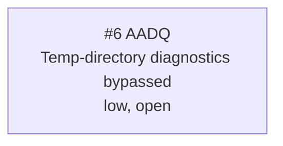

<!-- GENERATED, DO NOT EDIT: regenerated by /reversa-debugger-graph at 2026-08-17T00:10:00+07:00 from 1 bug -->

# Bug Graph: android-tls-bootstrap

## Clusters

The context has one confirmed bug, so no multi-bug structural cluster exists. The broader inspection cluster remains extraction observability and unproved TLS readiness.

## Impact Score

| Bug | Score | Basis |
|---|---:|---|
| `BUG-20260817-AADQ` | 0 | No supported or confirmed relationships |

Impact score is a triage heuristic and does not replace priority or severity.
