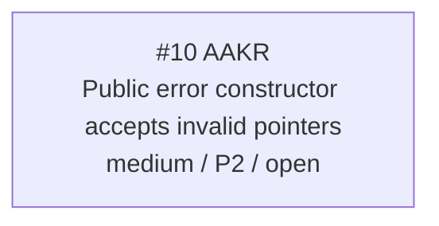

<!-- GENERATED, DO NOT EDIT: regenerated by /reversa-debugger-graph at 2026-08-17T00:30:00+07:00 from 1 bug -->

# Bug Graph: dart-ffi-facade

The single canonical defect concerns visibility and validation at the native error-wrapper boundary.

