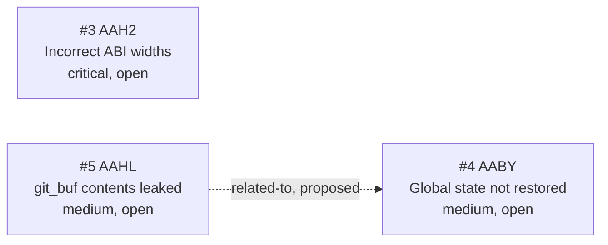

<!-- GENERATED, DO NOT EDIT: regenerated by /reversa-debugger-graph at 2026-08-16T23:59:00+07:00 from 3 bugs -->

# Bug Graph: libgit2-global-options

## Clusters

`BUG-20260816-AAH2` is the central operational risk because 11 wrappers share the ABI-width defect. `BUG-20260816-AABY` and `BUG-20260816-AAHL` form a proposed test-state hygiene cluster but have separate causal paths.

## Impact Score

| Bug | Score | Basis |
|---|---:|---|
| `BUG-20260816-AAH2` | 0 | No supported or confirmed relationships |
| `BUG-20260816-AABY` | 0 | Proposed relationships do not count |
| `BUG-20260816-AAHL` | 0 | Proposed relationships do not count |

Impact score is a triage heuristic and does not replace priority or severity.
