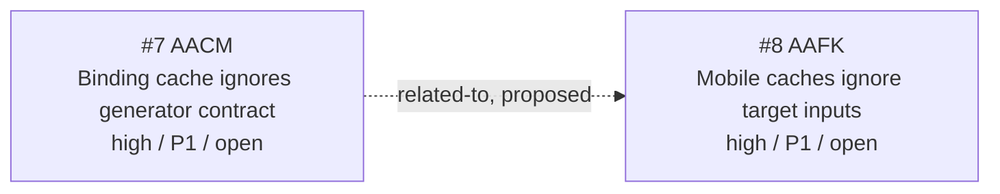

<!-- GENERATED, DO NOT EDIT: regenerated by /reversa-debugger-graph at 2026-08-17T00:20:00+07:00 from 2 bugs -->

# Bug Graph: native-build-bindings-generation

Both records concern incomplete cache identity, but they affect distinct producers and build outputs. The relationship remains proposed.

