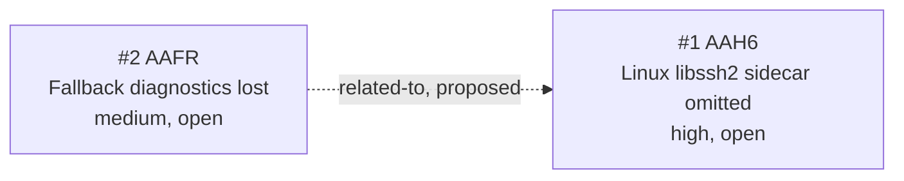

<!-- GENERATED, DO NOT EDIT: regenerated by /reversa-debugger-graph at 2026-08-16T23:50:00+07:00 from 2 bugs -->

# Bug Graph: native-loader-lifecycle

## Clusters

Both bugs converge on the desktop loader and platform packaging boundary. `BUG-20260816-AAH6` is the higher-impact operational candidate because it can leave a clean Linux consumer without a required native sidecar. The relationship remains proposed because no shared root cause has been established.

## Impact Score

| Bug | Score | Basis |
|---|---:|---|
| `BUG-20260816-AAH6` | 0 | No supported or confirmed relationships |
| `BUG-20260816-AAFR` | 0 | Proposed relationships do not count |

Impact score is a triage heuristic and does not replace priority or severity.
