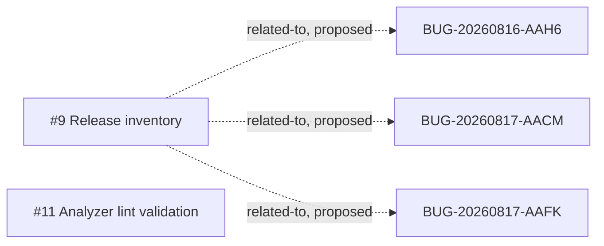

<!-- GENERATED, DO NOT EDIT: regenerado por /reversa-debugger-graph em 2026-08-24T13:27:14+07:00 a partir de 2 bugs -->

# Bug graph: validation-release-assembly

## Clusters

BUG-20260817-AAGV has three proposed cross-context relationships around native
release artifacts. BUG-20260824-AAKJ is independent and has no supported or
confirmed relationship.

## Impact score

The heuristic uses supported or confirmed caused-by, blocked-by,
regression-of, and related-to edges only. It does not replace priority or
severity.

| Bug | Score |
| --- | ---: |
| BUG-20260817-AAGV | 0 |
| BUG-20260824-AAKJ | 0 |
