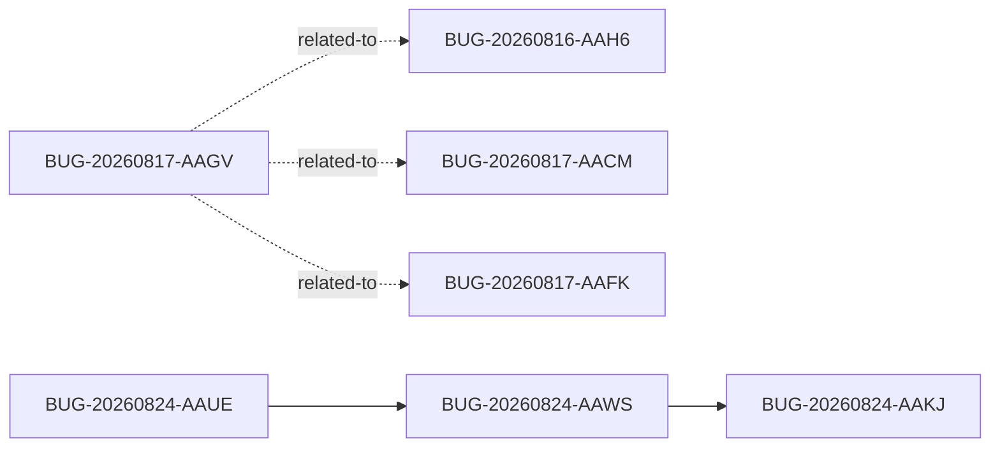

<!-- GENERATED, DO NOT EDIT: regenerado por /reversa-debugger-graph em 2026-08-26T13:54:57+07:00 a partir de 4 bugs -->

# Bug graph: validation-release-assembly

Impact score is a triage heuristic, not a substitute for priority/severity.

## Clusters

- Supported CI-validation cluster: BUG-20260824-AAUE → BUG-20260824-AAWS → BUG-20260824-AAKJ. BUG-20260824-AAWS is central because it connects the mobile source-contract failure to the validation-gate failure.
- Proposed cross-context proof/inventory cluster: BUG-20260817-AAGV converges with BUG-20260816-AAH6, BUG-20260817-AACM, and BUG-20260817-AAFK. These links indicate a possible structural supply-chain relationship but remain hypotheses.

## Impact score

Heuristic: caused×3 + blocked×2 + regressions×4 + related-to×1, counting only supported/confirmed edges; related-to is capped at 3. This does not replace priority/severity.

| Bug | Impact score |
| --- | ---: |
| BUG-20260817-AAGV | 0 |
| BUG-20260824-AAKJ | 1 |
| BUG-20260824-AAUE | 1 |
| BUG-20260824-AAWS | 2 |

Top 3: BUG-20260824-AAWS (2), BUG-20260824-AAKJ (1), BUG-20260824-AAUE (1). The 1-point tie is ordered by canonical ID.
