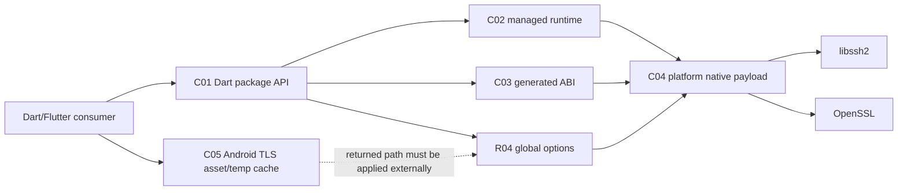
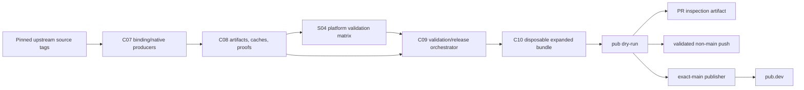

# Architecture Overview

## Scope and evidence boundary

`git2dart_binaries` is a cross-platform Flutter FFI package and the release factory that turns pinned libgit2 sources into a Dart ABI, five-platform native payloads, executable evidence, and an expanded pub package.

This synthesis describes the 2026-08-25 working tree over HEAD `b372be1cc2a50e8d13a0ecaa5b4e61780ce92f17`. The working tree contains feature `005-behavior-proving-tests`; it is not treated as a committed, hosted, or published revision.

Confidence scale:

- 🟢 **CONFIRMED** — observed in local source, configuration, executable local evidence, or an explicitly identified historical result.
- 🟡 **INFERRED** — an architectural interpretation or a claim bounded to a weaker evidence tier.
- 🔴 **GAP** — requires current hosted artifacts, a real platform, a sibling repository, GitHub settings, or the external registry.

No REST/GraphQL API, webhook endpoint, application server, database, message broker, or product cache exists. The only configured cloud/deployment surface is GitHub Actions plus pub.dev distribution.

## Architecture inventory

| Measure | Exact count | Definition |
|---|---:|---|
| Architectural planes | 2 | Runtime plane and supply/release plane; evidence authority is cross-cutting |
| Internal C4 containers | 10 | Runtime, generated/native data, evidence, build, artifact, release, and disposable-consumer boundaries |
| Internal components | 24 | 10 runtime, 9 evidence, and 5 supply/release components |
| Feature boundaries | 8 | Seven legacy boundaries plus `behavior-proving-tests` |
| External integrations | 9 | Native libraries, tooling/services, registry, and sibling consumer/coordinator |
| Conceptual entities | 49 | Runtime/build/release/evidence structures; no database PK/FK |
| Technical-debt/risk items | 16 | TD-01 through TD-16 below |
| High-risk coupled contracts | 8 | HC-01 through HC-08 below |
| Current red gaps | 8 | RG-01 through RG-08 below |

## Architectural purpose

The system has two cooperating planes.

1. **Runtime plane** — public Dart exports, the CI-generated FFI ABI, typed global-option adapters, platform-native loading, isolate-local checked lifecycle ownership, and Android certificate extraction.
2. **Supply/release plane** — binding generation, native builds, cache/proof validation, platform test jobs, expanded-package assembly, consumer proof, dry-run, and conditional publication.

Feature `005-behavior-proving-tests` adds a cross-cutting **evidence authority layer**. It does not create a third production runtime. Its fixtures, AST/YAML fact tools, subprocess probes, and disposable bundle determine what a claim is allowed to mean.

The tracked checkout is intentionally incomplete as a publishable product: `lib/src/bindings.dart` and native payload bytes are same-run CI inputs. A local or cached fixture may prove a specific behavior, but it cannot establish current workflow identity or publication.

## Ten-container model

| ID | Container | Technology / lifetime | Responsibility |
|---|---|---|---|
| C01 | Dart Package API | Dart library, consumer process | Public exports, helpers, diagnostics, runtime and option access |
| C02 | Managed Native Runtime | Dart FFI, isolate-local | Select/load one handle, initialize, pin calls/owners, rollback and shut down |
| C03 | Generated ABI Artifact | ffigen-generated Dart | Structs, enums, constants and native call declarations for pinned libgit2 |
| C04 | Platform Native Payload | SO/DLL/dylib/XCFramework | libgit2 plus required libssh2/OpenSSL artifacts for five platform families |
| C05 | Android TLS Asset and Temp Cache | Flutter asset + process-local state + temp file | Extract package CA bytes after initialization and cache the successful path |
| C06 | Behavior Evidence Harness | Dart tests, fixtures and bounded subprocesses | W001-W005 executable/local observations and sanitized evidence records |
| C07 | Native/Binding Producers | GitHub composite actions and native toolchains | Generate C03 and build C04 from pinned inputs |
| C08 | Artifact, Cache and Proof Fabric | GitHub artifacts/cache + JSON sidecars | Transfer same-run outputs; validate manifests, proofs and provenance |
| C09 | Validation and Release Orchestrator | GitHub Actions workflow | Enforce the 14-job DAG, W006 policy, gates, PR artifact and publication route |
| C10 | Disposable Expanded Bundle | Temporary package + clean consumer process | Inject binding/payload, force bundle-only resolution, compile public API and load native code |

The detailed diagrams are in `c4-context.md`, `c4-containers.md`, and `c4-components.md`.

## Component catalog

### Runtime components (10)

| ID | Component | Responsibility |
|---|---|---|
| R01 | Public Export Barrel | Exposes generated and handwritten package APIs |
| R02 | Error/String/Validation Helpers | Borrowed last-error projection, pointer decoding, SHA/ref/object predicates |
| R03 | Generated Libgit2 View | Binds the generated ABI to the selected dynamic library |
| R04 | Libgit2 Global Options | Dispatches 33 public option methods through 14 variadic FFI shapes |
| R05 | Loader Plan Selector | Encodes iOS process, Android no-fallback, and desktop fallback plans |
| R06 | Package Root Resolver | Uses override, package URI, or package-config discovery |
| R07 | Native Dependency Preloader | Applies platform-specific libssh2/OpenSSL load order |
| R08 | Lifecycle State and Owner Leases | Checked init/rollback/shutdown and exact call/owner pin accounting |
| R09 | Runtime Facade | Keeps bindings, options, handle, and lifecycle state in one isolate-local epoch |
| R10 | Android SSL Helper | Performs injected/default directory, asset and write operations; caches after write |

### Evidence components (9)

| ID | Component | Responsibility |
|---|---|---|
| E01 | BehaviorProofFixture | Guarded temp roots, bounded child process, cleanup and path sanitization |
| E02 | ABI Probe | W001 `size_t` round trip above `0xffffffff` |
| E03 | Loader Probe | W002 fallback/failure process and Android plan evidence |
| E04 | TLS Injected Seam | W003 cache-after-write and retry transitions |
| E05 | Native Cache Manifest CLI | W004 create/validate matrix for metadata, path, hash, size and provenance |
| E06 | Platform Release Proof CLI | W004 producer/aggregate proof and failure categories |
| E07 | Package Consumer Bundle CLI | W005 assembly, exact package resolution, public compile and native-load modes |
| E08 | Architecture AST Facts | W006 exact analyzer 8.2.0, lifecycle-owner and prohibited-global facts |
| E09 | Workflow Policy Facts | W006 fail-closed job/step/condition graph and authorization model |

### Supply/release components (5)

| ID | Component | Responsibility |
|---|---|---|
| S01 | Binding Generator | Runs ffigen from pinned official headers and uploads `cache-bindings` |
| S02 | Platform Native Builders | Build Android, iOS, Linux, macOS and Windows payloads |
| S03 | Cache/Provenance Publisher | Validates reusable native outputs and uploads manifests/proofs/sidecars |
| S04 | Platform Validation Matrix | Injects generated/native artifacts and runs desktop/mobile validation jobs |
| S05 | Release Assembler and Publisher | Downloads all inputs, gates the bundle and routes PR/non-main/main outcomes |

## Eight feature boundaries

| Feature | Architectural owner | Principal contracts | Behavior watch |
|---|---|---|---|
| `dart-ffi-facade` | R01-R03 | public exports, borrowed error lifetime, pointer/string predicates | W006 guards lifecycle structure indirectly |
| `native-loader-lifecycle` | R05-R09 | platform load plan, package fallback, checked lifecycle and pins | W002; W006 |
| `libgit2-global-options` | R04 | discriminator-to-variadic-shape and pointer-width ABI | W001 |
| `android-tls-bootstrap` | R10, C05 | directory → asset → write → commit; external apply step | W003 |
| `platform-packaging` | C04, S02 | artifact names, paths, link/load mode and plugin metadata | W002; W005 |
| `native-build-bindings-generation` | S01-S03 | pinned versions, CI-owned bindings, cache/provenance contract | W004; W005 |
| `validation-release-assembly` | S04-S05, C08-C10 | dependency DAG, proofs, inventory, size, consumer, dry-run, event route | W004-W006 |
| `behavior-proving-tests` | E01-E09 | evidence classification and FR-01–FR-08 replacement ledger | W001-W006 |

## Runtime interaction

## Supply, validation, and publication interaction

## Evidence authority ladder

Evidence is monotonic in authority only when the next tier is actually observed; lower tiers do not imply higher tiers.

| Tier | Authority | Typical components | What it can prove | Explicit boundary |
|---:|---|---|---|---|
| 1 | Source/configuration fact | R01-R10, workflow files | Presence, declared shape, recipe, static ordering | No execution |
| 2 | Parsed structural fact | E08, E09 | AST ownership and bounded YAML reachability/ordering | Name-based AST and simplified GitHub semantics |
| 3 | Injected deterministic behavior | R08 tests, E04 | Host-independent state transitions and retry edges | Not default device/native integration |
| 4 | Local fixture/CLI/subprocess/native behavior | E01-E07 | Exact host, fixture and declared payload behavior | Local/published-cache fixture is not current same-run CI |
| 5 | Same-run hosted behavior | C07-C10 on a current GitHub run | Generated/native identity within the observed run and platform jobs | Requires the actual run and downloaded artifacts |
| 6 | External outcome | pub.dev, `git2dart`, real consumers | Registry acceptance, sibling integration, live device/network behavior | Cannot be inferred from workflow intent |

The recorded 39/39 safe local cases and cached 1.12.1 Windows fixture reach tier 3/4 only. A green test containing `availability=unavailable` records a gap, not native success. Historical workflow run `32750817127` supports its predecessor revision only.

## External integrations (9)

| ID | External system | Protocol / format | Direction | Confidence |
|---|---|---|---|---|
| I01 | libgit2 1.9.6 | C ABI / dynamic or process symbols | runtime calls | 🟢 recipe and local declared fixture; 🔴 current hosted bytes |
| I02 | libssh2 1.11.1 | native link/load dependency | payload dependency | 🟢 recipe |
| I03 | OpenSSL 3.0.15 | native ABI, TLS/crypto, provenance sidecars | payload dependency | 🟢 recipe; 🔴 current all-platform bytes |
| I04 | Flutter/Dart/pub tooling | package resolution, assets, tests, pub dry-run | build/runtime tooling | 🟢 local configuration |
| I05 | Platform toolchains | CMake, NDK/Gradle, Xcode/CocoaPods, clang/MSVC/Ninja | build/package integration | 🟢 recipes |
| I06 | GitHub Actions | YAML jobs, caches, artifacts, secrets | hosted build/release control plane | 🟢 workflow graph; 🔴 current feature-005 run/settings |
| I07 | Upstream Git repositories | pinned tag checkout | build input | 🟢 declared versions; 🔴 tag authenticity |
| I08 | pub.dev | publisher action and Dart package registry | publication/distribution | 🟢 route; 🔴 current execution/acceptance |
| I09 | external `git2dart` | Dart dependency plus user-confirmed CI coordinator policy | consumer/cross-repository gate | 🟡/🔴 not inspected in this extraction |

## Conceptual data model

The 49 extracted entities describe isolate-local state, ephemeral files, manifests, workflow facts, proofs, and evidence records. There is no durable application database and therefore no real PK/FK model or migration. `erd-complete.md` preserves all 49 structures and conceptual cardinalities without inventing persistence.

## W001-W006 contract summary

| Watch | Required observation | Proven locally | Still outside local authority |
|---|---|---|---|
| W001 | 64-bit `0x100000011` survives the native `size_t` round trip | declared cached Windows fixture | current same-run/platform matrix |
| W002 | desktop bare-name then package fallback, two-stage terminal error; Android no fallback | isolated failure, declared payload load, Android plan | actual successful handle origin and device loading |
| W003 | cache only after write; directory/asset/write failures remain retryable | injected host transitions | default Android asset/filesystem, native option and HTTPS |
| W004 | corrupt/unsafe/incomplete/mismatched/unreadable artifacts fail non-zero and sanitized | CLI fixture matrices | real current producer payload, symlink/exception edge completeness |
| W005 | injected bundle-only package resolution and clean public/native consumer | local disposable bundle with declared fixture | authenticated same-run bytes and non-Linux hosted consumers |
| W006 | broad validation; exact-main publication only after required gates | AST/YAML structural facts | GitHub execution, permissions, credentials and registry |

## High-risk coupled contracts (8)

1. **HC-01 — pinned libgit2 source ↔ generated ABI ↔ every native payload.**
2. **HC-02 — exported artifact filename/path/dependency ↔ loader plan ↔ CMake/podspec/pubspec packaging.**
3. **HC-03 — raw libgit2 lifecycle calls ↔ isolate-local state/pins ↔ external owner drainage.**
4. **HC-04 — global-option discriminator ↔ one of 14 variadic shapes ↔ pointer width/native ownership.**
5. **HC-05 — managed init ↔ Android CA extraction ↔ native option application ↔ HTTPS behavior.**
6. **HC-06 — evidence prerequisite/status ↔ claim tier; `unavailable` must never become behavior success.**
7. **HC-07 — producer proof/provenance ↔ downloaded payload ↔ bundle evidence ↔ published bytes.**
8. **HC-08 — workflow DAG/event/ref guard ↔ sibling compatibility coordinator ↔ publication eligibility.**

## Technical debt and risk register (16)

| ID | Debt/risk | Impact | Confidence |
|---|---|---|---|
| TD-01 | Generated binding and native payload bytes are absent from the tracked checkout | source-only execution cannot represent the release product | 🟢 |
| TD-02 | Pub package is 1.12.1 while iOS/macOS podspec metadata is 1.11.2 | release metadata can diverge | 🟢 |
| TD-03 | Public generated ABI can bypass the managed lifecycle | external callers can violate lifecycle ownership | 🟢 |
| TD-04 | Runtime accounting is isolate-local while libgit2 count is process-global | unrelated isolates/FFI users are not coordinated | 🟢/🔴 external |
| TD-05 | Successful loader probe does not report the opened handle origin | ambient/system success can be mistaken for bundle fallback | 🟢 |
| TD-06 | Global-option native coverage and handwritten validation predicates are incomplete | ABI/semantic drift can escape selected probes | 🟢 |
| TD-07 | Android first initialization has no shared in-flight Future/mutex | concurrent calls can duplicate work/race state | 🟢 |
| TD-08 | Android cache hits do not revalidate file bytes/existence; failed writes may leave residue | stale/partial CA file can persist outside state model | 🟢 |
| TD-09 | CA extraction and native option application/HTTPS remain separate | extraction success can be overstated as TLS readiness | 🟢/🔴 external |
| TD-10 | Cache-manifest symlink containment, approved-exception behavior and one create error path are incomplete | unsafe/incoherent producer states may evade covered fixtures | 🟢 gap |
| TD-11 | Aggregate platform proof does not fully enforce inventory/version/attestation semantics or payload hashes | proof can be detached from assembled bytes | 🟢 |
| TD-12 | `same-run` and `bundle-proof.json` are labels/presence checks, not authenticated identity | local or cross-run inputs can be mislabeled | 🟢 |
| TD-13 | Disposable release consumer is Linux-only and platform proof runtime strength varies | cross-platform equivalence is not established | 🟢 |
| TD-14 | AST visitor is name-based and workflow evaluator implements a bounded YAML/condition subset | structural facts approximate full language/service semantics | 🟢 |
| TD-15 | External `git2dart` lifecycle/version coordinator has no current inspected workflow/run | selected-pair compatibility is unproved | 🔴 |
| TD-16 | GitHub protections/token scopes, upstream authenticity, SBOM/signing/attestation and current registry outcome are external | supply-chain/publication assurance remains bounded | 🔴; additional controls not currently requested |

## Architectural invariants

1. Bindings and all native outputs use the same pinned libgit2 input.
2. `lib/src/bindings.dart` is CI-owned, untracked, and supplied to consumers from the same workflow run.
3. Artifact names and paths agree across producer, proof, package metadata, loader and release inventory.
4. Managed initialization accepts only a positive native result; failed initialization attempts one balancing rollback.
5. Shutdown is rejected while transient calls or persistent owners remain.
6. W001 uses a value above `0xffffffff` and distinguishes unavailable from observed success.
7. W002 preserves desktop two-stage fallback and Android no-package-fallback.
8. W003 commits TLS cache state only after successful write and preserves retry after every dependency failure.
9. W004 rejects unsafe/corrupt/incomplete/mismatched/unreadable inputs with bounded sanitized diagnostics.
10. W005 requires injected binding/payload and exact bundle-only package resolution.
11. W006 keeps validation broadly reachable but credential-bearing publication reachable only on exact `refs/heads/main`.
12. Proof, inventory, provenance, size, disposable consumer and pub dry-run precede publication.
13. A local fixture result is never promoted to same-run hosted evidence.
14. A hosted validation result is never promoted to registry or external-consumer acceptance without observation.
15. Cross-repository claims remain inferred/gaps until the sibling repository and selected-pair run are inspected.

## Current red gaps (8)

1. **RG-01:** current feature-005 GitHub run and five-platform same-run artifacts.
2. **RG-02:** hash/identity join between producer proof, downloaded payload, disposable bundle and publication.
3. **RG-03:** observable origin of the successfully opened native library handle.
4. **RG-04:** real Android default TLS/HTTPS path, concurrent initialization and cached-file recovery.
5. **RG-05:** production lifecycle/version integration and selected-pair coordinator in external `git2dart`.
6. **RG-06:** current publisher execution, pub.dev registry acceptance and package availability.
7. **RG-07:** external GitHub protections, approvals, action/token scopes and secret controls.
8. **RG-08:** generated binding enum/discriminator inventory and native payload bytes absent from this checkout.

## Related artifacts

- `c4-context.md` — people, system, and nine external integrations.
- `c4-containers.md` — ten containers and runtime/supply communication.
- `c4-components.md` — 24 internal components.
- `erd-complete.md` — all 49 extracted structures.
- `traceability/spec-impact-matrix.md` — eight-feature impact and W001-W006 traceability.
- `deployment.md` — 14-job GitHub Actions build/release topology.
