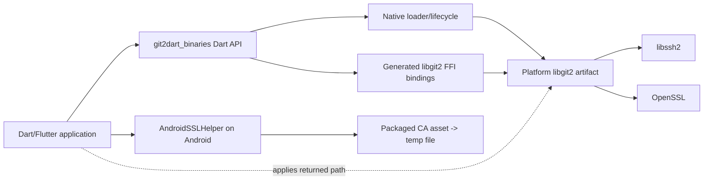
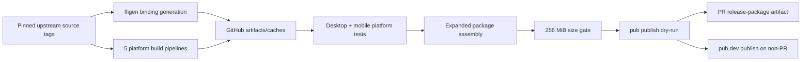

# Architecture Overview

## Scope

`git2dart_binaries` is a cross-platform Flutter FFI package and its release factory. It bridges Dart consumers to libgit2 and supplies the platform-native artifacts required at runtime.

This architecture is extracted only from `F:\git2dart_binaries` at commit `680d914c8e2b87682f0b68318aee855838eb58e8`.

Confidence: 🟢 **CONFIRMED** from local code/config/history; 🟡 **INFERRED** relationship; 🔴 **GAP** requiring external evidence.

## Architectural purpose

The system has two cooperating planes:

1. **Runtime plane** — public Dart exports, generated FFI declarations, dynamic/process loading, libgit2 initialization/global options, native errors, and Android certificate extraction.
2. **Supply plane** — GitHub Actions generates bindings, compiles upstream native dependencies, validates artifacts, tests platform packages, assembles the expanded pub package, and publishes it.

The tracked checkout is source and recipes. The actual release product is an expanded package assembled by CI with generated `bindings.dart` and native libraries.

## Context summary

| Actor/system | Relationship | Protocol/format | Confidence |
|---|---|---|---|
| Dart/Flutter application | Imports the package and calls Dart FFI API | Dart package API, native ABI | 🟢 |
| `git2dart` high-level package | Direct production consumer of `git2dart_binaries` and its managed runtime | Dart dependency/imports and managed runtime API | 🟢 cross-repository source evidence |
| libgit2 | Implements Git operations | C ABI | 🟢 |
| libssh2 | Supplies SSH transport | native link/shared dependency | 🟢 |
| OpenSSL | Supplies TLS/crypto | native link/shared dependency | 🟢 |
| Flutter tooling | Bundles FFI plugins/assets | pub/Flutter plugin metadata | 🟢 |
| CocoaPods/CMake/Gradle | Integrate native artifacts into apps | platform build metadata | 🟢 |
| GitHub Actions | Builds, tests, and assembles artifacts | workflow jobs/artifacts/caches | 🟢 |
| pub.dev | Receives validated package publication | Dart publisher action/tokens | 🟢 workflow intent; 🔴 current result |
| Upstream Git repositories | Supply pinned libgit2/libssh2/OpenSSL source | Git tag checkout | 🟢 |

No REST/GraphQL API, webhook endpoint, database, message queue, or application server is produced.

## Container model

### Runtime containers

- **Dart package API:** public exports and handwritten helpers.
- **Generated FFI layer:** generated Dart structs/enums/functions for libgit2.
- **Native loader/lifecycle:** resolves and initializes the correct library.
- **Platform artifact set:** libgit2 and platform-dependent libssh2/OpenSSL artifacts.
- **Android certificate asset/cache:** packaged CA bundle copied to temporary app storage.

### Supply containers

- **Binding-generation action:** converts pinned headers into Dart ABI declarations.
- **Platform native-build actions:** build normalized artifacts for Android, iOS, Linux, macOS, Windows.
- **Artifact/cache fabric:** GitHub artifacts and manifest-validated caches.
- **Platform test jobs:** inject the generated outputs and exercise loader/options/package behavior.
- **Release assembler/publisher:** combines all outputs, applies gates, and publishes.

## Component responsibilities

| Component | Primary responsibility | Direct dependencies |
|---|---|---|
| Dart FFI facade | Stable package entry and helpers | generated bindings, loader, ffi |
| Native loader/lifecycle | Platform selection, dependency preload, package-root fallback, and package-owned libgit2 lifecycle accounting | OS loader, package config, platform artifacts |
| Global-options wrapper | Typed dispatch to variadic `git_libgit2_opts` | generated enum/struct ABI, native libgit2 |
| Android TLS bootstrap | Extract CA asset after native initialization | Flutter asset bundle, temporary storage |
| Platform packaging | Map CI outputs to Flutter/CocoaPods/CMake/Gradle contracts | platform build systems |
| Native build/binding generation | Produce matching ABI and native libraries | upstream source tags/toolchains |
| Validation/release assembly | Establish publishable cross-platform evidence | every build/test artifact, pub.dev |

## Lifecycle Ownership Research — 2026-08-24

This focused Reversa Architect pass inspected the checked-out `F:\git2dart_binaries` and `F:\git2dart` sources. It establishes current implementation facts; it does not prove behavior of an unpublished package or third-party process participant.

| Evidence | Finding | Confidence |
|---|---|---|
| `git2dart_binaries/lib/src/runtime.dart:13-68` | `libgit2Runtime` is an isolate-local package-owned state machine. Its only raw `git_libgit2_init()` and `git_libgit2_shutdown()` callbacks are constructed in `Libgit2Runtime`; `bindings` and `options` ensure initialization before access. | 🟢 |
| `git2dart_binaries/test/public_lifecycle_api_test.dart` | The regression gate requires raw lifecycle transitions to exist only in the package-owned runtime. | 🟢 |
| `git2dart/pubspec.yaml:16`; `git2dart/lib/src/helpers/native_owner.dart:1-35` | `git2dart` depends on `git2dart_binaries`, obtains managed owner leases from `libgit2Runtime`, and attaches release to wrapper finalizers. | 🟢 |
| `git2dart/test/libgit2_lifecycle_source_test.dart:24-37` | A source-level regression test forbids raw lifecycle calls in `git2dart` production and says that only `git2dart_binaries` may own them. | 🟢 |
| `git2dart/lib/src/libgit2.dart:17-22`; `git2dart_binaries/lib/src/runtime.dart:67-68` | Both packages currently expose a public shutdown path: `Libgit2.shutdown()` delegates to `libgit2Runtime.shutdown()`. A downstream `git2dart` client can therefore terminate its isolate's lease. | 🟢 |

### Recommendation

`git2dart_binaries` is the lifecycle authority for native loading, raw init/shutdown transitions, and lease accounting. `git2dart` remains a managed consumer that acquires/releases object leases, not a second raw-count owner. The existing ready runtime and public lifecycle API are retained unchanged as a deliberate compatibility decision. 🟢 cross-repository source evidence; 🟢 user-confirmed policy

Public `Libgit2.shutdown()` and the corresponding binaries runtime behavior remain available. No automatic teardown or isolate-lifetime policy is introduced; consumers are expected to use the prepared runtime and shutdown misuse is considered unlikely. This consciously accepts the architectural risk without implementation change. 🟢 user-confirmed compatibility decision

The project deliberately does not define a new normal automatic teardown event or isolate-lifetime policy. Existing lease protections remain the observed behavior. 🟢 user-confirmed compatibility decision

### Risks and Remaining Decision

- The current public shutdown path can be misused by a downstream client, but retaining it is a deliberate compatibility decision. 🟢 current API; 🟢 accepted risk
- libgit2's count is process-global while the managed owner is isolate-local; the current tests cover independent isolate leases, but unrelated FFI users in the same process remain outside this package's enforcement boundary. 🟢 implementation/test scope; 🔴 external-process coordination.
- No lifecycle API change, automatic teardown, or isolate-lifetime policy is planned. The shutdown-misuse risk is accepted. 🟢 user-confirmed compatibility decision

## Cross-Repository Compatibility Policy — 2026-08-24

`git2dart_binaries` owns and pins the underlying libgit2 version. `git2dart` declares/selects the compatible major-version line of `git2dart_binaries`. Compatibility is governed by major versions; minor releases deliver fixes within the selected libgit2 version line and do not redefine the cross-package compatibility boundary. 🟢 user-confirmed policy

`git2dart` owns the single GitHub Actions release/build coordination point for this compatibility contract. It receives the selected `git2dart` + `git2dart_binaries` version pair, resolves it as the client uses it, and fully validates it through the client integration suite before feature-branch merge eligibility and again on post-merge `main` before publication. This is a user-confirmed policy; the checked workflow still contains no local `repository_dispatch`, `workflow_call`, or fresh cross-repository run evidence. 🟢 user-confirmed coordination policy; 🔴 current workflow/run evidence

## Integration model

### Runtime path

### Supply path

## Data model

There is no persistent domain database. The meaningful data structures are build/runtime descriptors:

- a pinned native version set;
- generated binding artifact;
- platform artifact sets;
- cache manifests/fingerprints;
- expanded release payload;
- package-config entries for fallback resolution;
- process-local Android TLS state;
- borrowed libgit2 native error pointers.

See `erd-complete.md` for the conceptual relationships and `data-dictionary.md` for field-level details.

## Deployment and distribution

The project deploys a package rather than a service. GitHub-hosted runners produce platform artifacts; the final Linux job assembles and validates the pub package. Pull requests retain an inspection artifact, while configured branch pushes can publish to pub.dev using secrets.

No Docker, Kubernetes, Terraform, or application cloud runtime configuration exists. `deployment.md` documents the CI/distribution topology because GitHub Actions and pub.dev are the only configured cloud deployment surfaces.

## Technical debt and risk register

| Item | Evidence | Impact | Confidence |
|---|---|---|---|
| Generated binding/native artifacts absent from tracked checkout | referenced files missing locally | source-only tests cannot establish release behavior | 🟢 |
| Unchecked `git_libgit2_init()` result | `util.dart` | initialization failure may surface later | 🟢 |
| Public client shutdown escape hatch | `Libgit2.shutdown()` delegates to `libgit2Runtime.shutdown()` | a downstream client can terminate an isolate lease despite package-owned raw transitions | 🟢 current API; 🟡 target-policy defect |
| Partial behavioral coverage of 33 global options | tests cover selected families | ABI/signature drift may escape | 🟢 |
| Android TLS extraction and application are separate | helper returns path only | extraction success can be mistaken for HTTPS readiness | 🟢 |
| Android/iOS first platform initialization is currently unsynchronized | no shared in-flight operation in inspected paths | user-confirmed policy requires one shared operation; implementation evidence is still absent | 🟢 observed implementation; 🟢 target policy |
| Apple podspec version 1.11.2 vs pub 1.12.1 | current manifests | confirmed exact three-way release-version policy makes mismatch release-blocking | 🟢 observed mismatch; 🟢 target policy |
| Platform plugin shims retain unused method-channel sample behavior | generated `getPlatformVersion` handlers | extra surface/confusion, low runtime impact | 🟢 |
| Missing Windows bundled-library directory | reviewer Question 3 user decision | must fail explicitly as an incomplete package; no bare system-library retry | 🟢 user-confirmed policy |
| No SBOM/signing/provenance verification documented | workflows | supply-chain assurance gap | 🔴 external/security gap |
| Cross-repository GitHub Actions coordinator is not yet evidenced in a workflow/run | `git2dart` is the user-confirmed owner; no cross-repository workflow dispatch/call or fresh run was inspected | selected-pair integration and release gate lack current execution proof | 🟢 user-confirmed policy; 🔴 current workflow/run evidence |

## Architectural invariants

1. Bindings and native artifacts use one pinned libgit2 version.
2. Platform artifact names must match loader and package-manager declarations.
3. macOS `install_name`, exported filename, podspec, and loader target must agree.
4. Android certificate configuration occurs after native initialization.
5. Pull requests cannot execute the publication step.
6. Publication remains downstream of all required platform tests/builds, size gate, and pub dry-run.
7. Cross-repository behavior is not upgraded from inferred to confirmed without direct consumer evidence.
8. `git2dart_binaries` pins libgit2; `git2dart` selects the compatible binaries major line, while minor fixes do not redefine the compatibility boundary. 🟢 user-confirmed policy
9. `git2dart` is the sole cross-repository release/build coordinator and must fully validate the selected client/binaries pair before feature merge eligibility and post-merge publication eligibility. 🟢 user-confirmed coordination policy
