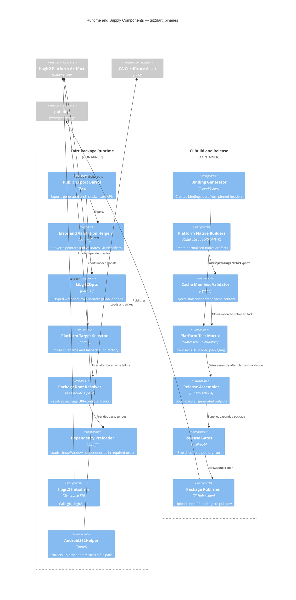

# C4 Level 3 — Components

## Cross-component coupling

- `Platform Target Selector` is coupled by filename to native builders and packaging manifests.
- `Libgit2Opts` is coupled by discriminator/signature to generated libgit2 enums and the pinned native ABI.
- `AndroidSSLHelper` is coupled by asset path to `pubspec.yaml` and by ordering to consumer startup.
- `Release Assembler` is coupled to every artifact name and target directory produced upstream.
