# C4 Level 3 — Components

## Diagram

```mermaid
C4Component
  title Components — 24 internal runtime, evidence, and supply/release components

  Container_Boundary(runtimeBoundary, "Runtime components (10)") {
    Component(r01, "R01 Public Export Barrel", "Dart", "Exports generated and handwritten public surfaces")
    Component(r02, "R02 Error/String/Validation Helpers", "Dart + ffi", "Borrowed errors, UTF-8 conversion, SHA/ref/object predicates")
    Component(r03, "R03 Generated Libgit2 View", "ffigen Dart ABI", "Binds generated functions and types to one handle")
    Component(r04, "R04 Libgit2 Global Options", "Dart variadic FFI", "33 methods over 14 discriminator-specific shapes")
    Component(r05, "R05 Loader Plan Selector", "dart:io", "Selects iOS process, Android, desktop and unsupported routes")
    Component(r06, "R06 Package Root Resolver", "dart:isolate + JSON", "Resolves override, package URI, and package config")
    Component(r07, "R07 Native Dependency Preloader", "dart:ffi", "Loads platform dependencies in required order")
    Component(r08, "R08 Lifecycle State and Owner Leases", "Dart", "Checked init/rollback/shutdown and call/owner pins")
    Component(r09, "R09 Runtime Facade", "Dart FFI", "Shares handle, bindings, options and lifecycle epoch")
    Component(r10, "R10 Android SSL Helper", "Flutter + file I/O", "Extracts CA bytes and commits cache after write")
  }

  Container_Boundary(evidenceBoundary, "Evidence components (9)") {
    Component(e01, "E01 BehaviorProofFixture", "Dart test support", "Guarded temp root, bounded process, cleanup and sanitization")
    Component(e02, "E02 ABI Probe", "Dart FFI subprocess", "W001 size_t serialization above uint32")
    Component(e03, "E03 Loader Probe", "Plain Dart subprocess", "W002 fallback/failure and Android plan")
    Component(e04, "E04 TLS Injected Seam", "Injected async operations", "W003 success/cache/failure/retry transitions")
    Component(e05, "E05 Cache Manifest CLI", "Python", "W004 manifest create/validate fixture matrix")
    Component(e06, "E06 Platform Proof CLI", "Python", "W004 proof create/aggregate validation")
    Component(e07, "E07 Consumer Bundle CLI", "Dart", "W005 assemble, resolve, compile and native-load modes")
    Component(e08, "E08 Architecture AST Facts", "analyzer 8.2.0", "W006 lifecycle ownership and prohibited-global facts")
    Component(e09, "E09 Workflow Policy Facts", "yaml 3.1.3", "W006 DAG, trigger, condition and step-order facts")
  }

  Container_Boundary(supplyBoundary, "Supply and release components (5)") {
    Component(s01, "S01 Binding Generator", "ffigen/libclang", "Creates untracked bindings from pinned official headers")
    Component(s02, "S02 Platform Native Builders", "CMake/NDK/Xcode/MSVC", "Builds normalized payloads for five platform families")
    Component(s03, "S03 Cache/Provenance Publisher", "Composite actions + Python", "Validates and uploads manifests, exports, proofs, sidecars")
    Component(s04, "S04 Platform Validation Matrix", "Flutter tests + simulator/emulator", "Injects outputs and exercises platform packages")
    Component(s05, "S05 Release Assembler and Publisher", "GitHub Actions + pub", "Downloads, qualifies, bundles, dry-runs and conditionally publishes")
  }

  Component_Ext(native, "libgit2/libssh2/OpenSSL", "Native ABI")
  Component_Ext(github, "GitHub Artifact and Cache Service", "Hosted storage/execution")
  Component_Ext(registry, "pub.dev", "External registry")
  Component_Ext(externalConsumer, "git2dart / real consumer", "External integration boundary")

  Rel(r01, r02, "Exports")
  Rel(r01, r09, "Exports")
  Rel(r01, r10, "Exports")
  Rel(r09, r05, "Selects load plan")
  Rel(r05, r06, "Requests desktop fallback root")
  Rel(r06, r07, "Supplies package root")
  Rel(r07, native, "Preloads dependencies")
  Rel(r09, r03, "Constructs over loaded handle")
  Rel(r09, r04, "Constructs over loaded handle")
  Rel(r09, r08, "Delegates lifecycle/pins")
  Rel(r03, native, "Calls")
  Rel(r04, native, "Calls git_libgit2_opts")
  Rel(r10, r04, "Returned path is applied externally", "not invoked internally")

  Rel(e01, e02, "Hosts bounded process")
  Rel(e01, e03, "Hosts bounded process")
  Rel(e04, r10, "Injects dependency operations")
  Rel(e02, r04, "Exercises pointer-width option")
  Rel(e03, r05, "Observes plan/fallback")
  Rel(e05, s03, "Exercises manifest contract")
  Rel(e06, s03, "Exercises platform-proof contract")
  Rel(e07, r01, "Compiles public imports")
  Rel(e07, r09, "Runs native-load mode")
  Rel(e08, r08, "Checks lifecycle ownership structure")
  Rel(e09, s05, "Checks graph and authorization structure")

  Rel(s01, s03, "Uploads binding artifact")
  Rel(s02, s03, "Uploads native exports/proofs")
  Rel(s03, github, "Stores/retrieves")
  Rel(s03, s04, "Supplies generated/native inputs")
  Rel(s04, s05, "Gates release eligibility")
  Rel(s05, e06, "Validates eight proof scopes")
  Rel(s05, e07, "Runs disposable consumer")
  Rel(s05, registry, "Publishes on exact main push")
  Rel(externalConsumer, r01, "Consumes selected package", "current evidence gap")
```

## Component counts and ownership

| Boundary | Count | IDs |
|---|---:|---|
| Runtime | 10 | R01-R10 |
| Evidence | 9 | E01-E09 |
| Supply/release | 5 | S01-S05 |
| **Total** | **24** | |

## W001-W006 component routing

| Watch | Primary components | Required non-inflation rule |
|---|---|---|
| W001 | E01, E02, R04 | `unavailable` is not an ABI pass |
| W002 | E01, E03, R05-R07, R09 | supplied root is not proof of opened handle origin |
| W003 | E04, R10 | injected host success is not default Android/HTTPS success |
| W004 | E05, E06, S03 | fixture rejection is not current producer/payload proof |
| W005 | E07, R01, R09, S05 | `same-run` label/proof-file presence is not byte identity |
| W006 | E08, E09, S04, S05 | parsed facts are not GitHub execution or registry outcome |

## Critical coupling

- R03/R04/S01/S02 share the pinned libgit2 ABI contract.
- R05-R07/S02/S05 share artifact names, dependency order and package paths.
- R08/R09 and the external consumer share lifecycle ownership and drainage obligations.
- R10/R04 and external application startup share Android TLS ordering.
- E05-E09/S03-S05 share evidence classification, same-run routing, and publication authorization.
