# C4 Level 2 — Containers

## Diagram

```mermaid
C4Container
  title Containers — git2dart_binaries runtime, evidence, and supply topology

  Person(consumer, "Consumer Process", "Dart or Flutter application")
  Person(maintainer, "Maintainer / Release Engineer", "Runs local evidence or interprets hosted release gates")

  System_Boundary(system, "git2dart_binaries") {
    Container(api, "C01 Dart Package API", "Dart", "Public exports, helpers, runtime and option access")
    Container(runtime, "C02 Managed Native Runtime", "Dart FFI", "Loads one handle and manages isolate-local init, pins, rollback, and shutdown")
    ContainerDb(bindings, "C03 Generated ABI Artifact", "ffigen Dart file", "Same-run generated libgit2 declarations; intentionally untracked")
    ContainerDb(payload, "C04 Platform Native Payload", "SO/DLL/dylib/XCFramework", "Five-platform libgit2 and dependency artifacts")
    ContainerDb(tls, "C05 Android TLS Asset and Temp Cache", "PEM + process state + temp file", "Extracts certificate bytes and caches a successful path")
    Container(evidence, "C06 Behavior Evidence Harness", "Dart tests, CLIs, AST/YAML tools, subprocesses", "Produces tier-bounded W001-W006 observations")
    Container(builders, "C07 Native and Binding Producers", "GitHub composite actions + native toolchains", "Generate bindings and platform exports from pinned inputs")
    ContainerDb(fabric, "C08 Artifact, Cache and Proof Fabric", "GitHub artifacts/cache + JSON", "Transfers manifests, payloads, proofs, and provenance sidecars")
    Container(release, "C09 Validation and Release Orchestrator", "GitHub Actions", "Enforces the 14-job DAG and event/ref publication policy")
    Container(bundle, "C10 Disposable Expanded Bundle", "Temporary Dart/Flutter package", "Injects same-run inputs and runs a clean bundle-only consumer")
  }

  System_Ext(native, "libgit2 + libssh2 + OpenSSL", "Pinned native implementation and dependencies")
  System_Ext(upstream, "Pinned Upstream Git Sources", "libgit2, libssh2, OpenSSL repositories")
  System_Ext(tooling, "Flutter/Dart and Platform Toolchains", "pub, CMake, NDK, Xcode, CocoaPods, MSVC")
  System_Ext(github, "GitHub Actions Service", "Hosted execution, artifact/cache storage, secrets")
  System_Ext(pubdev, "pub.dev", "Package registry")
  System_Ext(git2dart, "git2dart", "External high-level consumer/coordinator")

  Rel(consumer, api, "Imports/calls", "Dart")
  Rel(api, runtime, "Requests bindings/options/calls")
  Rel(api, bindings, "Exports/uses")
  Rel(runtime, bindings, "Constructs view over selected handle")
  Rel(runtime, payload, "Opens/preloads/calls", "native ABI")
  Rel(payload, native, "Contains/links")
  Rel(consumer, tls, "Requests Android CA extraction")
  Rel(tls, runtime, "Must follow managed initialization", "ordering contract")
  Rel(maintainer, evidence, "Runs/interprets")
  Rel(evidence, runtime, "Executes injected and process probes")
  Rel(evidence, bindings, "Requires declared ABI input for native probes")
  Rel(evidence, payload, "Requires declared native input for native probes")
  Rel(builders, upstream, "Checks out pinned tags", "Git")
  Rel(builders, tooling, "Invokes")
  Rel(builders, bindings, "Produces")
  Rel(builders, payload, "Produces")
  Rel(builders, fabric, "Uploads manifests, exports, proofs")
  Rel(github, builders, "Executes")
  Rel(github, release, "Executes")
  Rel(release, fabric, "Downloads and validates same-run inputs")
  Rel(release, evidence, "Runs structural/platform checks")
  Rel(release, bundle, "Assembles from downloaded binding/payload")
  Rel(bundle, api, "Copies source and injects generated ABI")
  Rel(bundle, payload, "Contains selected native payload")
  Rel(release, pubdev, "Publishes only on exact main push")
  Rel(git2dart, api, "Consumes selected version", "external evidence gap")
```

## Container authority

| Container group | Evidence tier | Qualification |
|---|---|---|
| C01-C05 | source plus runtime/fixture where executed | Runtime declarations do not prove the current package bytes |
| C06 | parsed, injected, fixture, or native-local | Every record must state prerequisites and unavailable status |
| C07-C09 | checked-in workflow graph; hosted only when a run is observed | Local YAML cannot prove GitHub execution or secrets |
| C10 | local disposable or same-run hosted bundle | Caller label and proof-file presence are not cryptographic identity |

## Communication constraints

- C03 and C04 must originate from the same workflow graph as the release candidate; checkout binding fallback is invalid.
- C08 cache hits are inputs to validation, not acceptance.
- C09 requires proof, inventory, provenance, size, C10 public/native checks, and pub dry-run before publication.
- C10 currently supplies Linux release-consumer proof; other platform runtime strength comes from their platform jobs/proofs.
- No container is a product database or long-lived server.
