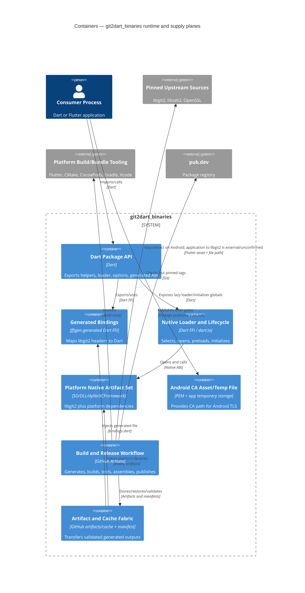

# C4 Level 2 — Containers

```mermaid
C4Container
  title Containers — git2dart_binaries runtime and supply planes

  Person(consumer, "Consumer Process", "Dart or Flutter application")

  System_Boundary(system, "git2dart_binaries") {
    Container(dartapi, "Dart Package API", "Dart", "Exports helpers, loader, options, generated ABI")
    Container(bindings, "Generated Bindings", "ffigen-generated Dart FFI", "Maps libgit2 headers to Dart")
    Container(loader, "Native Loader and Lifecycle", "Dart FFI / dart:io", "Selects, opens, preloads, initializes")
    Container(native, "Platform Native Artifact Set", "SO/DLL/dylib/XCFramework", "libgit2 plus platform dependencies")
    Container(tlsasset, "Android CA Asset/Temp File", "PEM + app temporary storage", "Provides CA path for Android TLS")
    Container(ci, "Build and Release Workflow", "GitHub Actions", "Generates, builds, tests, assembles, publishes")
    Container(cache, "Artifact and Cache Fabric", "GitHub artifacts/cache + manifest", "Transfers validated generated outputs")
  }

  System_Ext(upstream, "Pinned Upstream Sources", "libgit2, libssh2, OpenSSL")
  System_Ext(platform, "Platform Build/Bundle Tooling", "Flutter, CMake, CocoaPods, Gradle, Xcode")
  System_Ext(pubdev, "pub.dev", "Package registry")

  Rel(consumer, dartapi, "Imports/calls", "Dart")
  Rel(dartapi, bindings, "Exports/uses", "Dart FFI")
  Rel(dartapi, loader, "Exposes lazy loader/initializer globals", "Dart")
  Rel(loader, native, "Opens and calls", "Native ABI")
  Rel(consumer, tlsasset, "May extract on Android; application to libgit2 is external/unconfirmed", "Flutter asset + file path")
  Rel(ci, upstream, "Checks out pinned tags", "Git")
  Rel(ci, platform, "Invokes", "Build tools")
  Rel(ci, cache, "Stores/restores/validates", "Artifacts and manifests")
  Rel(cache, bindings, "Injects generated file", "bindings.dart")
  Rel(cache, native, "Injects platform libraries", "binary artifacts")
  Rel(ci, pubdev, "Publishes after gates", "Package publisher + secrets")
```

There is no database or service container. The artifact/cache fabric is build-time storage, not product runtime persistence.
