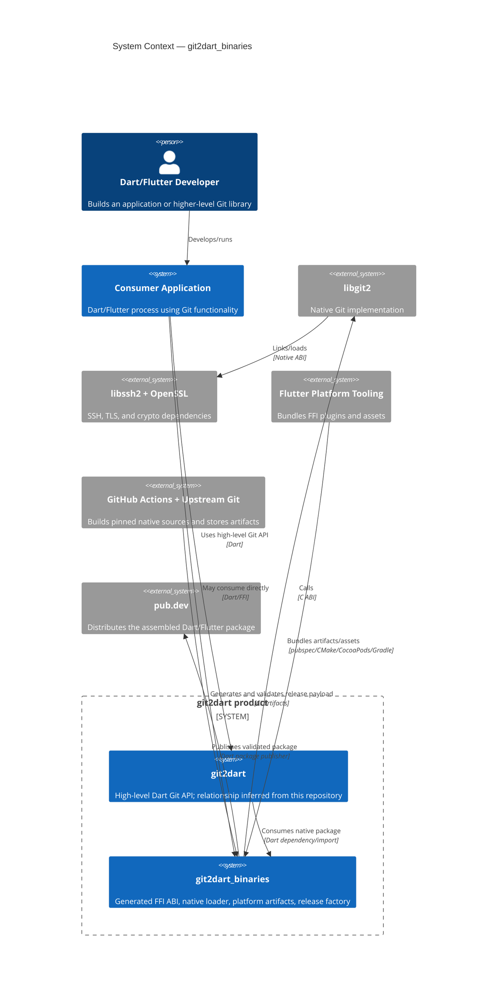

# C4 Level 1 — System Context

🟢 All external systems except the exact `git2dart -> git2dart_binaries` consumer edge are directly evidenced locally. That cross-repository relation remains 🟡 INFERRED.

