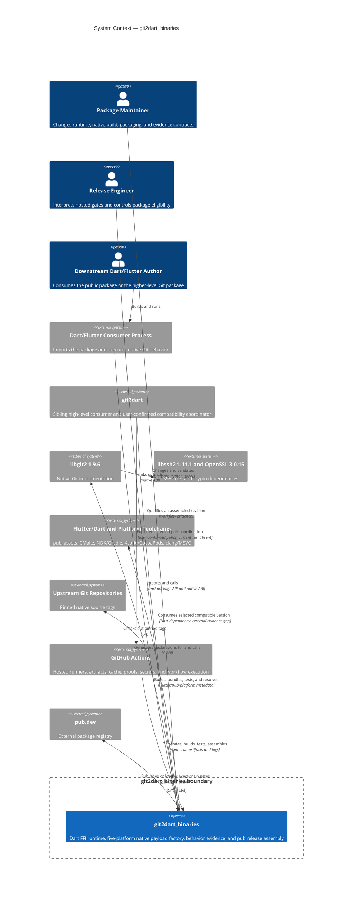

# C4 Level 1 — System Context

## Diagram

## Relationship qualification

| Relationship | Protocol/format | Confidence and boundary |
|---|---|---|
| Consumer → public package | Dart imports, FFI calls | 🟢 public surface; 🔴 current external consumer outcome |
| Package → libgit2 | generated and handwritten C ABI | 🟢 source/fixture; 🔴 current hosted bytes |
| libgit2 → libssh2/OpenSSL | native linkage/load | 🟢 build recipes; 🔴 current five-platform artifact inspection |
| Package ↔ Flutter/platform tooling | pubspec, assets, CMake, CocoaPods, Gradle | 🟢 checked-in configuration |
| GitHub Actions → package product | jobs, artifacts, caches, proofs | 🟢 checked-in graph; 🔴 current feature-005 run |
| Package → pub.dev | publisher action and tokens | 🟢 configured route; 🔴 execution/registry acceptance |
| `git2dart` ↔ package | version selection, managed runtime, CI coordination | 🟡 policy/context only in this extraction; 🔴 current workflow/run |

## Nine external integrations

The context model counts nine integrations: libgit2, libssh2, OpenSSL, Flutter/Dart tooling, platform toolchains, GitHub Actions, upstream Git repositories, pub.dev, and external `git2dart`. libssh2 and OpenSSL share one diagram node for readability but remain separate native contracts.

## Evidence boundary

The system context distinguishes configured relationships from observed outcomes. Local fixtures can establish exact host behavior; only a current GitHub run can establish same-run artifacts, and only pub.dev/`git2dart`/real-device observation can establish external outcomes.
