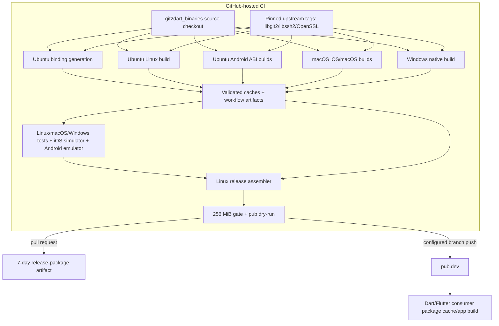

# Build, Deployment, and Distribution Topology

The repository has no deployed server runtime. Its deployment is the construction and publication of a multi-platform pub package through GitHub Actions.

## Runner topology

| Workload | Runner/tooling | Output |
|---|---|---|
| Bindings | Ubuntu, Flutter, libclang, ffigen | `bindings.dart` |
| Linux | Ubuntu, clang/CMake/OpenSSL | `libgit2.so`, `libssh2.so` |
| Android | Ubuntu, NDK/OpenSSL/CMake, four ABIs | four shared-library sets |
| iOS | macOS/Xcode/OpenSSL/CMake | device/simulator XCFramework slices |
| macOS | macOS/clang/CMake | self-contained `libgit2.dylib` |
| Windows | Windows/MSVC/Ninja/CMake/OpenSSL | libgit2/libssh2/OpenSSL DLLs |
| Final assembly | Ubuntu/Flutter/pub tooling | expanded publishable package |

## Environment and secrets

- Versions are workflow environment values; cache keys also include fingerprints and recipe hashes.
- Publication references pub.dev access/refresh token secrets.
- Pull requests cannot execute the publisher step by the local workflow condition.
- 🔴 GitHub environment protection, secret scopes, branch protection, artifact attestations, and token rotation are external and unverified.

## Deployment gates

1. Native build/test and essential symbol validation.
2. Generated bindings plus platform artifacts injected into test jobs.
3. Desktop tests and mobile simulator/emulator tests.
4. Expanded package assembly with every supported platform.
5. Expanded size not greater than 256 MiB.
6. `dart pub publish --dry-run` succeeds.
7. Event route selects PR artifact or real publication.

## Recovery characteristics

- Failed jobs stop the dependency DAG; no partial publication path is defined.
- Invalid caches are cleared and rebuilt.
- PRs preserve a short-lived assembled package for inspection.
- There is no documented automated rollback/unpublish mechanism after pub.dev publication.
- 🔴 A release run/result for the current local commit was not verified in this extraction.

