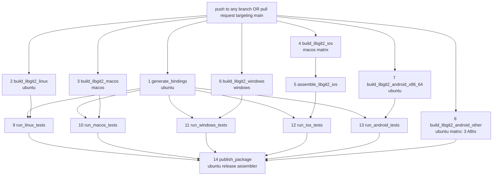
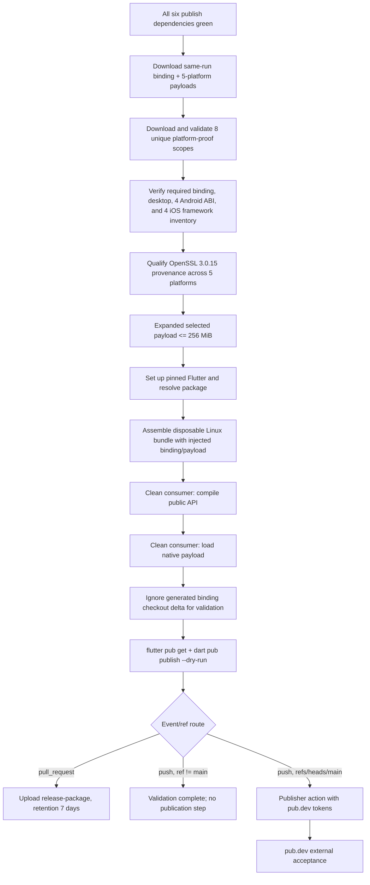

# Build, Deployment, and Distribution Topology

## Applicability

Detailed deployment documentation is applicable because `.github/workflows/build_package.yml` and composite GitHub Actions are cloud execution configuration. The repository has **no Dockerfile, docker-compose, Kubernetes, Terraform, deployed server, or long-lived cloud runtime**. “Deployment” here means hosted construction, validation, and pub.dev distribution of a multi-platform package.

This document describes the checked-in workflow graph. It does not claim a current feature-005 run, GitHub setting, secret authorization, publisher execution, or registry acceptance.

## Fourteen-job GitHub Actions DAG

The `publish_package.needs` list contains the five platform test jobs plus `build_libgit2_android_other`. It cannot become eligible while any required dependency fails. 🟢 checked-in graph; 🔴 current hosted execution.

## Producer and runner topology

| Job route | Runner/tooling | Primary output / proof |
|---|---|---|
| `generate_bindings` | Ubuntu, Flutter 3.44.0, libclang, ffigen | `cache-bindings` with untracked `bindings.dart` |
| Linux build | Ubuntu, CMake/compiler/OpenSSL | `cache-linux`, manifest/provenance/proof |
| macOS build | macOS, Xcode/clang/CMake | `cache-macos`, self-contained `libgit2.dylib`, proof/attestation |
| iOS build + assemble | macOS matrix/Xcode/CMake | slice artifacts then `cache-ios` XCFrameworks/proof |
| Windows build | Windows, MSVC/Ninja/CMake/OpenSSL | `cache-windows` DLL set/provenance/proof |
| Android x86_64 build | Ubuntu, NDK/CMake | emulator payload/proof |
| Android other matrix | Ubuntu, NDK/CMake | arm64-v8a, x86, armeabi-v7a payloads/proofs |
| Platform tests | corresponding host/simulator/emulator | injected binding/native behavior and platform proof artifacts |
| `publish_package` | Ubuntu, Flutter/Dart/Python | expanded package, consumer evidence, PR artifact or publisher input |

## Release assembly and gate order

## Artifact and proof routing

| Artifact/fabric item | Producer | Consumer | Authority boundary |
|---|---|---|---|
| `cache-bindings` | `generate_bindings` | every platform test and release assembly | same workflow graph; current artifact not inspected |
| `cache-{linux,macos,windows,ios}` | platform builders | platform tests and release assembly | recipe/route confirmed; current bytes absent |
| `cache-android-<ABI>` | Android builders | emulator/matrix release assembly | four ABI routes |
| `platform-proof-*` | platform producer/test routes | release proof validator | eight unique scopes; aggregate semantic/hash gaps remain |
| provenance sidecars | platform builders/cache restore | OpenSSL qualification | must cover Windows/Linux/macOS/Android/iOS |
| disposable bundle | `publish_package` | clean public/native consumer | Linux only; `same-run` label is not an attestation |
| `release-package` | `publish_package` on PR | human/download consumer | seven-day inspection artifact; not publication |

Cache reuse is not a green gate by itself. Restored content must satisfy the manifest/provenance contract before upload/consumption.

## Evidence authority across deployment

| Observation | Maximum claim |
|---|---|
| Local source and parsed workflow facts | job/step/condition shape and bounded reachability |
| Local fixture or cached published package | exact fixture/host behavior only |
| Current hosted job logs and downloaded artifacts | observed run/platform/same-run routing |
| Publisher action result | attempted/accepted upload as reported by action |
| pub.dev lookup and external consumer | registry availability and consumability |

The 39/39 safe local result and cached 1.12.1 Windows fixture are not substitutes for this topology’s current hosted execution. Historical run `32750817127` belongs to a predecessor revision.

## Trigger, concurrency, and authorization

- Push validation is configured for every branch (`branches: ['**']`).
- Pull-request validation is configured for pull requests targeting `main`.
- PR runs use a concurrency group and cancel an earlier in-progress PR run for the same key.
- The credential-bearing publisher step requires both `github.event_name == 'push'` and `github.ref == 'refs/heads/main'`.
- PR and non-main push routes can validate but cannot reach the publisher condition.
- The publisher uses referenced pub.dev access/refresh secrets and `skipTests: true`; correctness therefore depends on all prior gates.

🟢 These are checked-in policy facts. 🔴 Branch protection, required checks, environments, approvals, secret scopes/rotation, fork behavior, action integrity, and organization permissions are external.

## Version and package identity

| Input | Pinned/declared value | Role |
|---|---:|---|
| libgit2 | 1.9.6 | generated ABI and every native builder |
| libssh2 | 1.11.1 | SSH native dependency |
| OpenSSL | 3.0.15 | TLS/crypto build input and release provenance gate |
| Flutter | 3.44.0 | hosted Flutter toolchain |
| pub package | 1.12.1 | package metadata |
| iOS/macOS podspec | 1.11.2 | current metadata mismatch; release risk |

The intended identity chain is:

`workflow revision + pinned inputs → generated binding/native exports → proofs/provenance → downloaded release payload → disposable bundle → dry-run → publication`.

The workflow routes these items from one run, but it does not yet provide a cryptographic/hash join across every arrow.

## Failure and recovery characteristics

- A failed required job prevents `publish_package` eligibility.
- Invalid caches are cleared/rebuilt by producer routes rather than accepted as hits.
- Proof, inventory, provenance, size, consumer, or dry-run failure stops the release job before publication.
- Bounded fixture/consumer processes fail on timeout; a declared missing native prerequisite is `unavailable`, not a behavior pass.
- PR output is recoverable for seven days through the release artifact.
- There is no checked-in automated pub.dev rollback/unpublish route.
- GitHub Actions can rerun jobs/workflows, but rerun identity and artifact replacement semantics were not observed here.

## Deployment red gaps

1. Current feature-005 hosted run and all same-run platform artifacts.
2. Hash/identity join from proof/provenance to payload, bundle and published package.
3. Actual native handle origin in successful consumer/loader runs.
4. Android default TLS/HTTPS and concurrency behavior.
5. Current external `git2dart` selected-pair coordinator run.
6. Current publisher execution and pub.dev registry acceptance.
7. GitHub protections, approvals, secrets/token scopes and action trust.
8. Generated binding/native bytes absent from the checked-out source snapshot.
