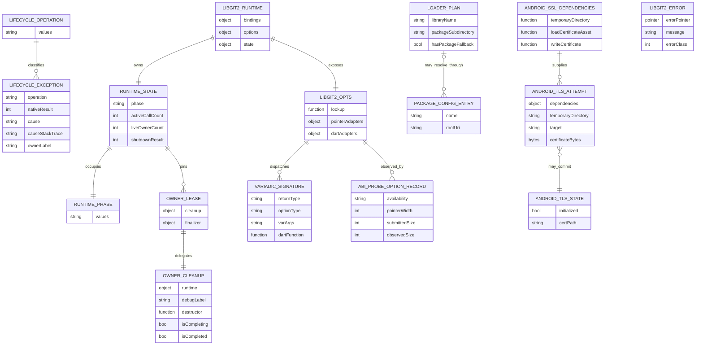
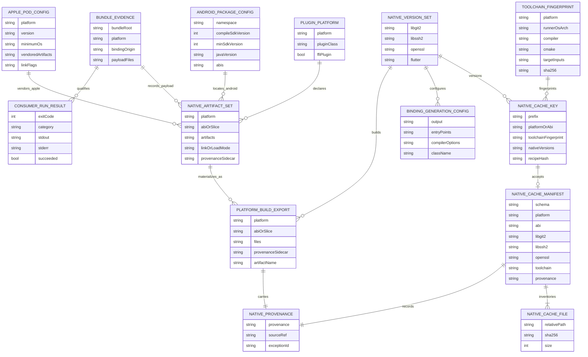
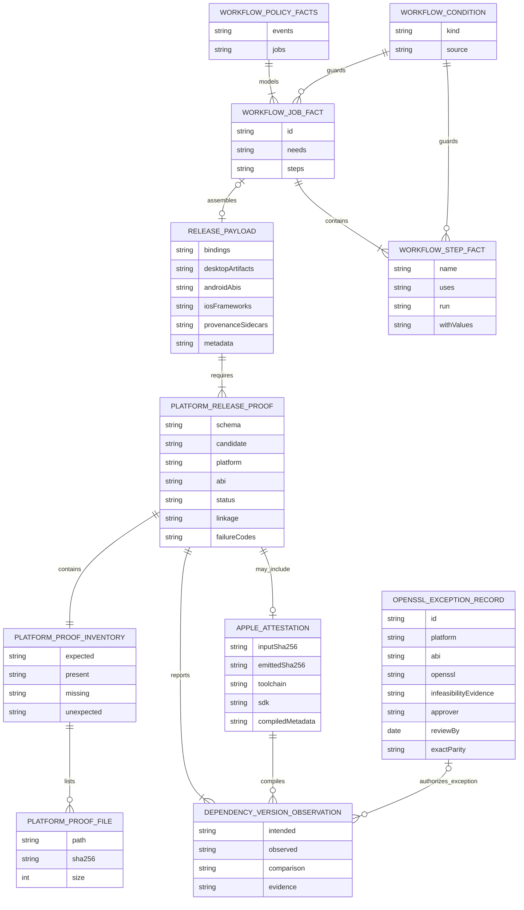
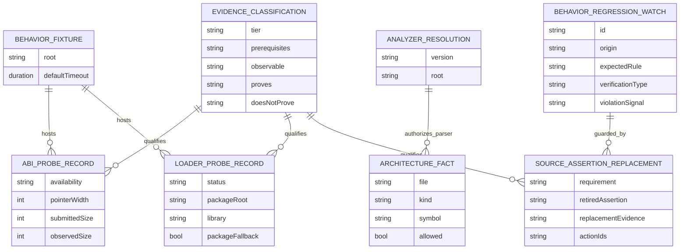

# Complete Conceptual Entity Model

## Applicability

The repository has no database, ORM, migrations, durable business records, or persistence keys. The diagrams therefore model the **49 extracted runtime, build, release, and evidence structures** with conceptual cardinalities. PK/FK labels are intentionally not invented; identifiers such as relative paths, job IDs, candidates, and watch IDs are ephemeral contract fields rather than database keys.

| Group | Entity count |
|---|---:|
| Dart FFI, managed runtime, options, Android TLS | 16 |
| Platform packaging, native build, cache | 14 |
| Release proof and workflow model | 11 |
| Behavior evidence model | 8 |
| **Total** | **49** |

## 1. Dart FFI, managed runtime, options, and Android TLS (16)

Entity name mapping: `LIFECYCLE_OPERATION=Libgit2LifecycleOperation`, `LIFECYCLE_EXCEPTION=Libgit2LifecycleException`, `LIBGIT2_ERROR=LibGit2Error`, `LIBGIT2_RUNTIME=Libgit2Runtime`, `RUNTIME_STATE=Libgit2RuntimeState`, `OWNER_LEASE=Libgit2OwnerLease`, `OWNER_CLEANUP=OwnerCleanup`, `RUNTIME_PHASE=RuntimePhase`, `LOADER_PLAN=NativeLoaderPlan`, `PACKAGE_CONFIG_ENTRY=PackageConfigEntry`, `LIBGIT2_OPTS=Libgit2Opts`, `VARIADIC_SIGNATURE=VariadicSignatureFamily`, `ABI_PROBE_OPTION_RECORD=AbiProbeRecord`, `ANDROID_SSL_DEPENDENCIES=AndroidSSLDependencies`, `ANDROID_TLS_STATE=AndroidTLSCompletionState`, and `ANDROID_TLS_ATTEMPT=AndroidTLSInitializationAttempt`.

## 2. Platform packaging, native build, and cache (14)

Entity name mapping: `PLUGIN_PLATFORM=FlutterPluginPlatformRecord`, `NATIVE_ARTIFACT_SET=NativeArtifactSet`, `ANDROID_PACKAGE_CONFIG=AndroidPackageConfiguration`, `APPLE_POD_CONFIG=ApplePodPackageConfiguration`, `BUNDLE_EVIDENCE=BundleEvidence`, `CONSUMER_RUN_RESULT=ConsumerRunResult`, `NATIVE_VERSION_SET=NativeVersionSet`, `TOOLCHAIN_FINGERPRINT=ToolchainFingerprint`, `NATIVE_CACHE_KEY=NativeCacheKey`, `NATIVE_CACHE_MANIFEST=NativeCacheManifest`, `NATIVE_CACHE_FILE=NativeCacheFileRecord`, `NATIVE_PROVENANCE=NativeProvenanceRecord`, `BINDING_GENERATION_CONFIG=BindingGenerationConfiguration`, and `PLATFORM_BUILD_EXPORT=PlatformBuildExport`.

## 3. Release proof and workflow model (11)

Entity names correspond directly to `ReleasePayload`, `PlatformReleaseProof`, `PlatformProofInventory`, `PlatformProofFileRecord`, `DependencyVersionObservation`, `ApplePlatformAttestation`, `WorkflowCondition`, `WorkflowStepFact`, `WorkflowJobFact`, `WorkflowPolicyFacts`, and `OpenSSLExceptionRecord`.

## 4. Behavior evidence model (8)

Entity names correspond to `BehaviorProofFixture`, `ABIProbeRecord`, `LoaderProbeRecord`, `AnalyzerResolution`, `ArchitectureFact`, `BehaviorRegressionWatch`, `SourceAssertionReplacement`, and `EvidenceClassification`.

## Cardinality and lifecycle notes

- Runtime relations are isolate-local and in-memory; `OwnerLease` multiplicity is logical pin accounting, not persisted ownership.
- Cache/proof/payload relations exist as files and hosted artifacts during a workflow run.
- One release candidate expects eight unique proof scopes: Linux, macOS, Windows, iOS, Android x86_64, and three other Android ABIs.
- A bundle may produce several consumer-run results, but those results prove only their exact bundle/host/mode.
- Evidence classification is analytical: it prevents a source, parser, injected, or local fixture record from claiming hosted/publication authority.

## Persistence statement

The only handwritten runtime file is the extracted Android `cacert.pem`. CI caches/artifacts and disposable bundles are external or temporary filesystem state. There is no schema migration and no durable referential integrity engine; hash, path, candidate, and job relationships must be checked by code/workflow gates.
