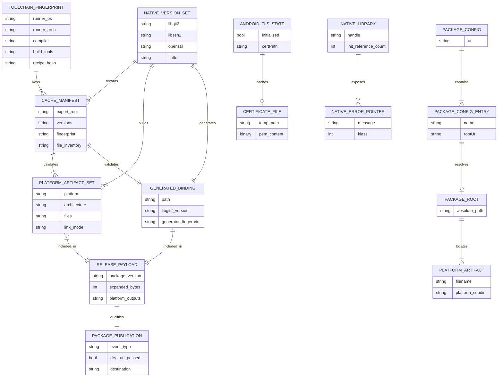

# Conceptual Artifact and Runtime Data Model

No database, ORM, schema migration, or persistent business entity exists. This ERD-style diagram models structured build/runtime data that crosses component boundaries.

## Classification

- 🟢 `NATIVE_VERSION_SET`, package config, Android TLS state, and native error fields are directly represented in local configuration/code.
- 🟢 Artifact sets, cache manifests, and release payload membership are represented by workflows/actions.
- 🟡 `PACKAGE_PUBLICATION` is a conceptual record of pipeline state; the repository does not persist it as a local entity.
- 🟡 `NATIVE_LIBRARY.init_reference_count` belongs to libgit2 semantics; local production code does not track it.

## Persistence statement

The only runtime file created by handwritten code is the Android temporary `cacert.pem`. CI artifacts/caches are external ephemeral storage managed by GitHub. No product database relationship or primary/foreign key exists.
