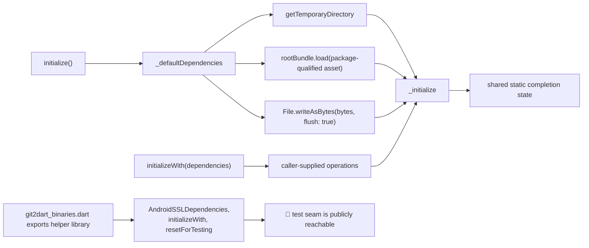

# Android TLS Dependency Wiring

🟢 Host tests select injected operations and therefore exercise the core transition logic. 🔴 They do not execute the default Flutter asset or Android path-provider wiring.
