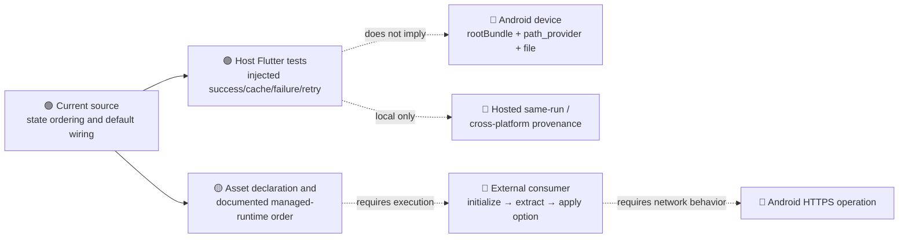

# Android TLS Evidence Boundaries

The evidence chain is intentionally non-transitive: definitions, asset declarations, and local injected tests do not establish device execution, external application of the path, HTTPS success, or hosted provenance.
