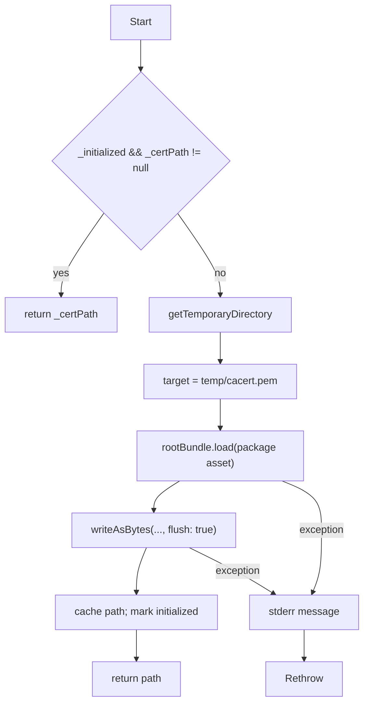

# `AndroidSSLHelper.initialize` Function

```mermaid
flowchart TD
  Start --> Guard{"_initialized && _certPath != null"}
  Guard -- yes --> Cached["return _certPath"]
  Guard -- no --> GetTemp["getTemporaryDirectory"]
  GetTemp --> Target["target = temp/cacert.pem"]
  Target --> Load["rootBundle.load(package asset)"]
  Load --> Write["writeAsBytes(..., flush: true)"]
  Write --> Cache["cache path; mark initialized"]
  Cache --> Return["return path"]
  Load -->|exception| Catch["stderr message"] --> Rethrow
  Write -->|exception| Catch
```

