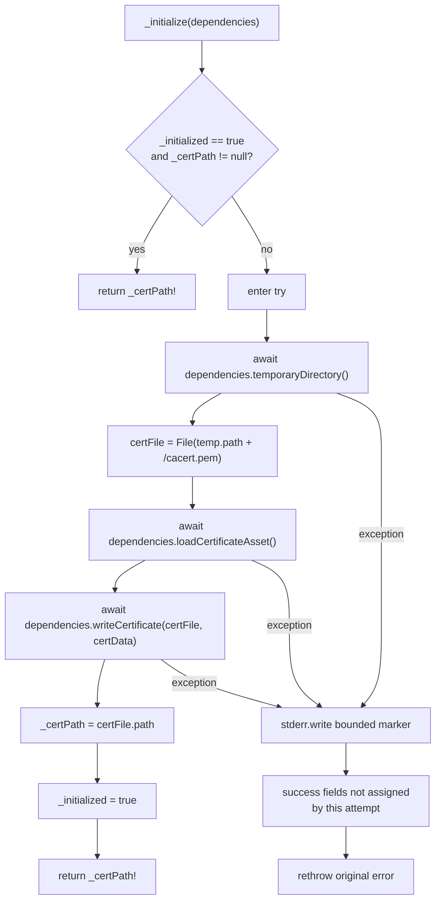

# `AndroidSSLHelper._initialize` Function

🟢 The commit occurs only after the writer Future completes. 🟡 A throwing writer can leave an untracked partial file. 🔴 No in-flight operation serializes concurrent first calls.
