# Android TLS Cache and Retry State

```mermaid
stateDiagram-v2
  [*] --> Cold: _initialized=false, _certPath=null
  Cold --> Attempting: first call passes guard
  Attempting --> Ready: writer completes; path assigned; flag=true
  Attempting --> Cold: directory/load/write throws; rethrow
  Ready --> Ready: sequential call returns cached path
  Ready --> Cold: resetForTesting()
  state Attempting {
    [*] --> Directory
    Directory --> Asset
    Asset --> Write
  }
  note right of Attempting
    No stored Future or mutex.
    Concurrent calls can enter together.
  end note
  note right of Ready
    Cache hit does not re-check
    file existence or contents.
  end note
```

🟢 Feature-005 host tests cover Cold → Ready, Ready → Ready, and failure → Cold → Ready. 🔴 They do not cover concurrent entrants or external deletion/mutation of the cached file.
