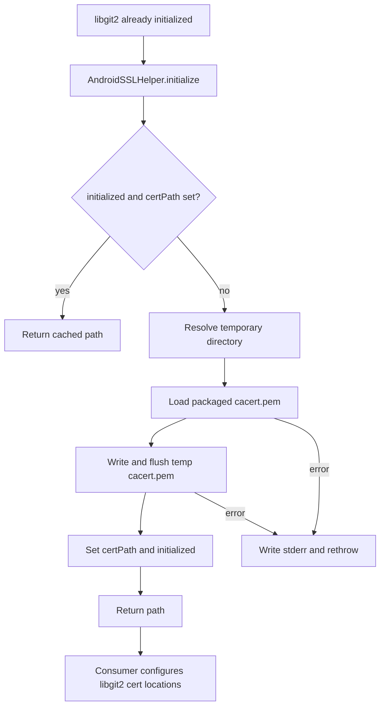

# Android TLS Bootstrap Flow

```mermaid
flowchart TD
  Prereq["libgit2 already initialized"] --> Init["AndroidSSLHelper.initialize"]
  Init --> Cached{"initialized and certPath set?"}
  Cached -- yes --> ReturnCached["Return cached path"]
  Cached -- no --> Temp["Resolve temporary directory"]
  Temp --> Asset["Load packaged cacert.pem"]
  Asset --> Write["Write and flush temp cacert.pem"]
  Write --> State["Set certPath and initialized"]
  State --> Return["Return path"]
  Asset -->|error| Error["Write stderr and rethrow"]
  Write -->|error| Error
  Return --> Consumer["Consumer configures libgit2 cert locations"]
```

