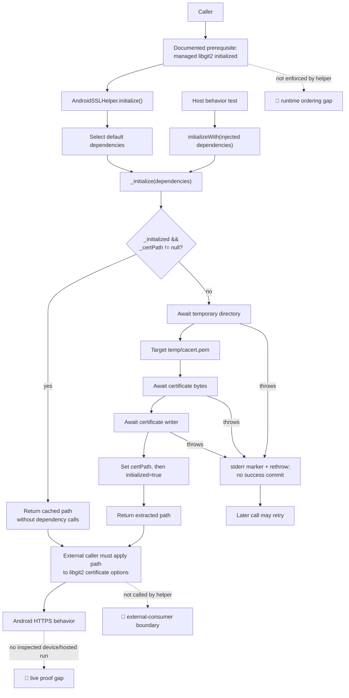

# Android TLS Bootstrap Flow

🟢 The solid extraction path is source-confirmed; feature-005 host tests execute the injected state edges. Dotted nodes identify obligations that the helper and those host tests do not execute.
