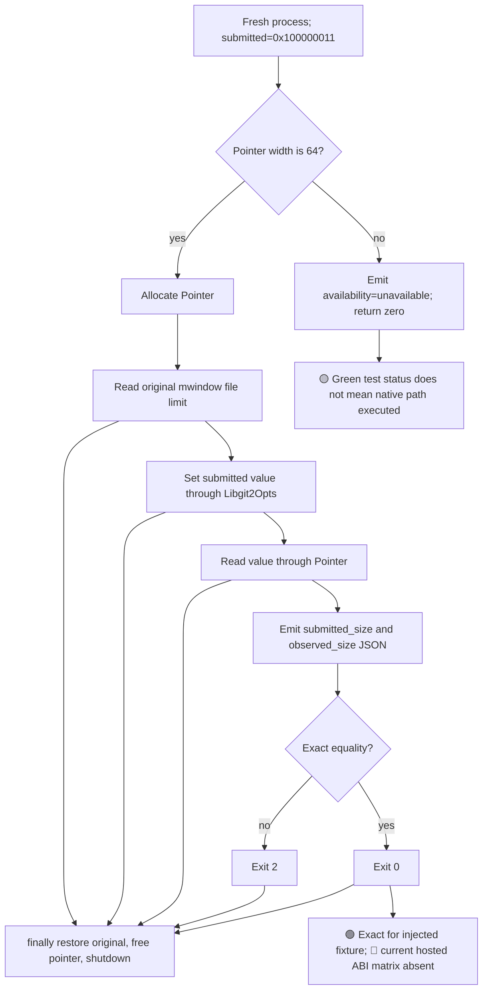

# W001 Serialized ABI Probe

```mermaid
flowchart TD
  Start["Fresh process; submitted=0x100000011"] --> Width{"Pointer width is 64?"}
  Width -- no --> Unavailable["Emit availability=unavailable; return zero"]
  Width -- yes --> Allocate["Allocate Pointer<Size>"]
  Allocate --> Original["Read original mwindow file limit"]
  Original --> Set["Set submitted value through Libgit2Opts"]
  Set --> Observe["Read value through Pointer<Size>"]
  Observe --> Emit["Emit submitted_size and observed_size JSON"]
  Emit --> Equal{"Exact equality?"}
  Equal -- no --> Exit2["Exit 2"]
  Equal -- yes --> Exit0["Exit 0"]
  Original --> Finally["finally restore original, free pointer, shutdown"]
  Set --> Finally
  Observe --> Finally
  Exit2 --> Finally
  Exit0 --> Finally
  Unavailable --> Gap["🟡 Green test status does not mean native path executed"]
  Exit0 --> Boundary["🟢 Exact for injected fixture; 🔴 current hosted ABI matrix absent"]
```

