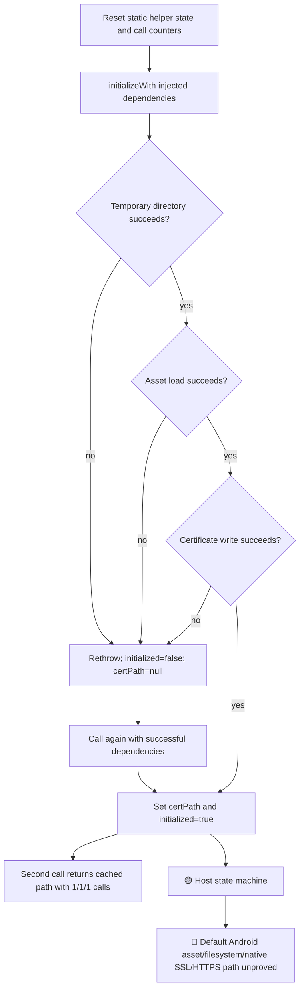

# W003 Android TLS Injected Retry Matrix

```mermaid
flowchart TD
  Reset["Reset static helper state and call counters"] --> Attempt["initializeWith injected dependencies"]
  Attempt --> Directory{"Temporary directory succeeds?"}
  Directory -- no --> Failure["Rethrow; initialized=false; certPath=null"]
  Directory -- yes --> Asset{"Asset load succeeds?"}
  Asset -- no --> Failure
  Asset -- yes --> Write{"Certificate write succeeds?"}
  Write -- no --> Failure
  Write -- yes --> Commit["Set certPath and initialized=true"]
  Commit --> Again["Second call returns cached path with 1/1/1 calls"]
  Failure --> Retry["Call again with successful dependencies"]
  Retry --> Commit
  Commit --> Boundary["🟢 Host state machine"]
  Boundary --> Gap["🔴 Default Android asset/filesystem/native SSL/HTTPS path unproved"]
```

