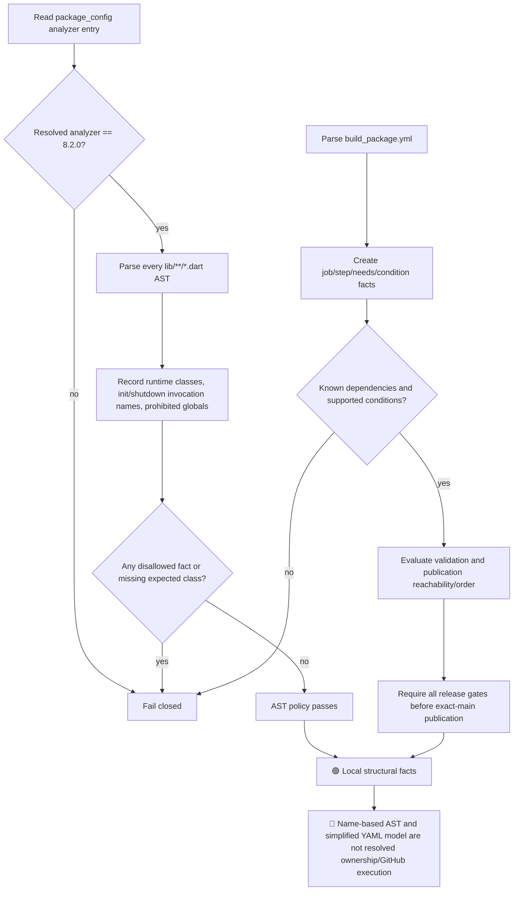

# W006 AST and Workflow Fact Oracles

```mermaid
flowchart TD
  Config["Read package_config analyzer entry"] --> Version{"Resolved analyzer == 8.2.0?"}
  Version -- no --> Fail["Fail closed"]
  Version -- yes --> ParseLib["Parse every lib/**/*.dart AST"]
  ParseLib --> Facts["Record runtime classes, init/shutdown invocation names, prohibited globals"]
  Facts --> Violations{"Any disallowed fact or missing expected class?"}
  Violations -- yes --> Fail
  Violations -- no --> ASTPass["AST policy passes"]
  YAML["Parse build_package.yml"] --> Jobs["Create job/step/needs/condition facts"]
  Jobs --> Supported{"Known dependencies and supported conditions?"}
  Supported -- no --> Fail
  Supported -- yes --> Reach["Evaluate validation and publication reachability/order"]
  Reach --> GraphPass["Require all release gates before exact-main publication"]
  ASTPass --> Boundary["🟢 Local structural facts"]
  GraphPass --> Boundary
  Boundary --> Gap["🔴 Name-based AST and simplified YAML model are not resolved ownership/GitHub execution"]
```

