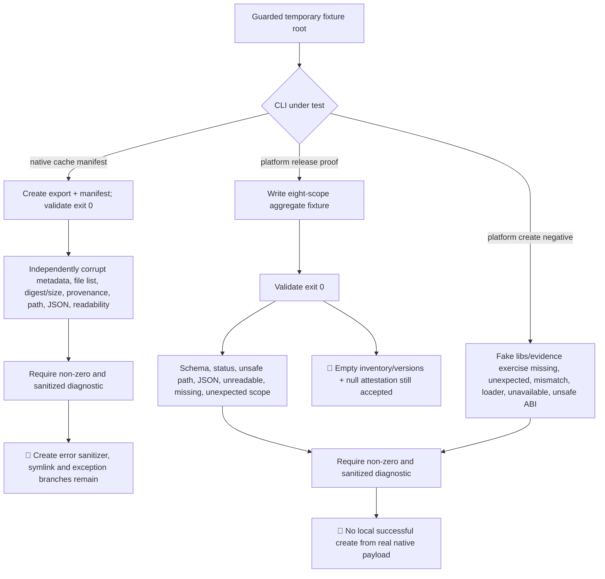

# W004 Artifact CLI Fixture Matrices

```mermaid
flowchart TD
  Root["Guarded temporary fixture root"] --> Tool{"CLI under test"}
  Tool -- native cache manifest --> ManifestValid["Create export + manifest; validate exit 0"]
  ManifestValid --> ManifestCorrupt["Independently corrupt metadata, file list, digest/size, provenance, path, JSON, readability"]
  ManifestCorrupt --> ManifestReject["Require non-zero and sanitized diagnostic"]
  Tool -- platform release proof --> Aggregate["Write eight-scope aggregate fixture"]
  Aggregate --> AggregateValid["Validate exit 0"]
  AggregateValid --> ProofCorrupt["Schema, status, unsafe path, JSON, unreadable, missing, unexpected scope"]
  ProofCorrupt --> ProofReject["Require non-zero and sanitized diagnostic"]
  Tool -- platform create negative --> CreateFail["Fake libs/evidence exercise missing, unexpected, mismatch, loader, unavailable, unsafe ABI"]
  CreateFail --> ProofReject
  AggregateValid --> Gap["🔴 Empty inventory/versions + null attestation still accepted"]
  ManifestReject --> Gap2["🔴 Create error sanitizer, symlink and exception branches remain"]
  ProofReject --> Gap3["🔴 No local successful create from real native payload"]
```

