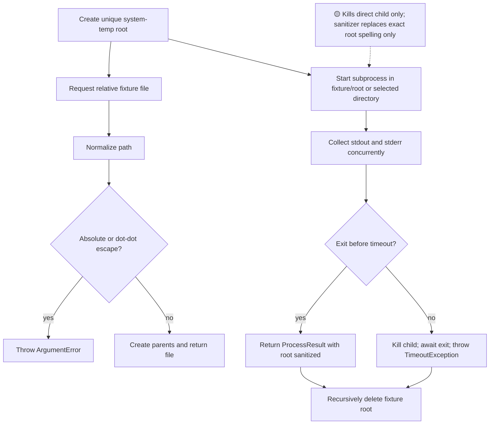

# BehaviorProofFixture Lifecycle

```mermaid
flowchart TD
  Create["Create unique system-temp root"] --> File["Request relative fixture file"]
  File --> Normalize["Normalize path"]
  Normalize --> Safe{"Absolute or dot-dot escape?"}
  Safe -- yes --> Reject["Throw ArgumentError"]
  Safe -- no --> Parents["Create parents and return file"]
  Create --> Run["Start subprocess in fixture/root or selected directory"]
  Run --> Streams["Collect stdout and stderr concurrently"]
  Streams --> Timeout{"Exit before timeout?"}
  Timeout -- yes --> Result["Return ProcessResult with root sanitized"]
  Timeout -- no --> Kill["Kill child; await exit; throw TimeoutException"]
  Result --> Dispose["Recursively delete fixture root"]
  Kill --> Dispose
  Gap["🟡 Kills direct child only; sanitizer replaces exact root spelling only"] -.-> Run
```

