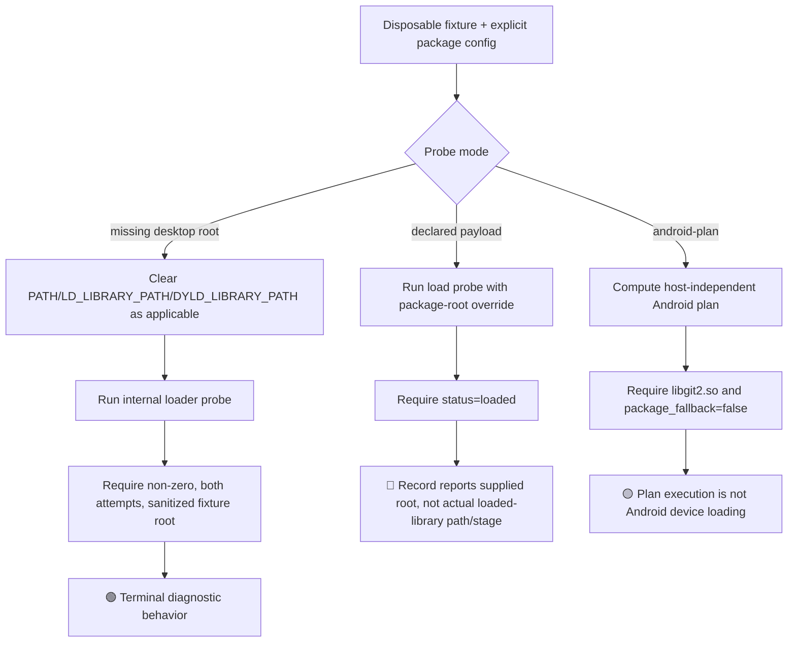

# W002 Loader Subprocess Matrix

```mermaid
flowchart TD
  Fixture["Disposable fixture + explicit package config"] --> Mode{"Probe mode"}
  Mode -- missing desktop root --> Scrub["Clear PATH/LD_LIBRARY_PATH/DYLD_LIBRARY_PATH as applicable"]
  Scrub --> FailLoad["Run internal loader probe"]
  FailLoad --> FailAssert["Require non-zero, both attempts, sanitized fixture root"]
  Mode -- declared payload --> SuccessLoad["Run load probe with package-root override"]
  SuccessLoad --> SuccessAssert["Require status=loaded"]
  Mode -- android-plan --> Plan["Compute host-independent Android plan"]
  Plan --> PlanAssert["Require libgit2.so and package_fallback=false"]
  SuccessAssert --> Gap["🔴 Record reports supplied root, not actual loaded-library path/stage"]
  PlanAssert --> Gap2["🟡 Plan execution is not Android device loading"]
  FailAssert --> Proven["🟢 Terminal diagnostic behavior"]
```

