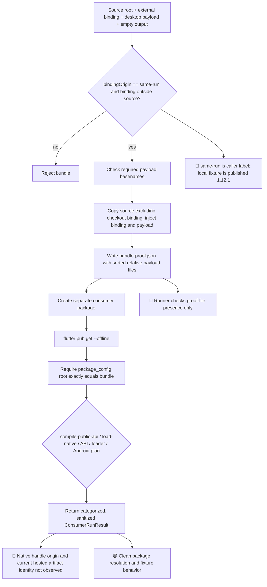

# W005 Disposable Consumer Evidence

```mermaid
flowchart TD
  Inputs["Source root + external binding + desktop payload + empty output"] --> Origin{"bindingOrigin == same-run and binding outside source?"}
  Origin -- no --> Reject["Reject bundle"]
  Origin -- yes --> Inventory["Check required payload basenames"]
  Inventory --> Assemble["Copy source excluding checkout binding; inject binding and payload"]
  Assemble --> Evidence["Write bundle-proof.json with sorted relative payload files"]
  Evidence --> Temp["Create separate consumer package"]
  Temp --> Offline["flutter pub get --offline"]
  Offline --> Resolve["Require package_config root exactly equals bundle"]
  Resolve --> Mode{"compile-public-api / load-native / ABI / loader / Android plan"}
  Mode --> Result["Return categorized, sanitized ConsumerRunResult"]
  Evidence --> Gap["🔴 Runner checks proof-file presence only"]
  Origin --> Gap2["🔴 same-run is caller label; local fixture is published 1.12.1"]
  Result --> Gap3["🔴 Native handle origin and current hosted artifact identity not observed"]
  Result --> Proven["🟢 Clean package resolution and fixture behavior"]
```

