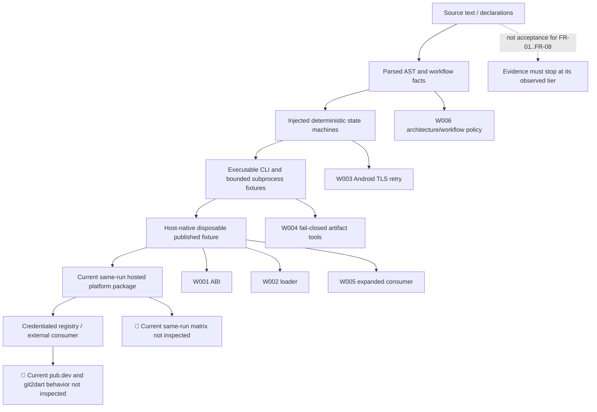

# Behavior-Proving Tests Evidence Map

```mermaid
flowchart TD
  Source["Source text / declarations"] --> Parsed["Parsed AST and workflow facts"]
  Parsed --> Deterministic["Injected deterministic state machines"]
  Deterministic --> CLI["Executable CLI and bounded subprocess fixtures"]
  CLI --> NativeFixture["Host-native disposable published fixture"]
  NativeFixture --> Hosted["Current same-run hosted platform package"]
  Hosted --> Publication["Credentialed registry / external consumer"]
  Source -. "not acceptance for FR-01..FR-08" .-> Boundary["Evidence must stop at its observed tier"]
  Parsed --> W6["W006 architecture/workflow policy"]
  Deterministic --> W3["W003 Android TLS retry"]
  CLI --> W4["W004 fail-closed artifact tools"]
  NativeFixture --> W1["W001 ABI"]
  NativeFixture --> W2["W002 loader"]
  NativeFixture --> W5["W005 expanded consumer"]
  Hosted --> Gap["🔴 Current same-run matrix not inspected"]
  Publication --> Gap2["🔴 Current pub.dev and git2dart behavior not inspected"]
```

