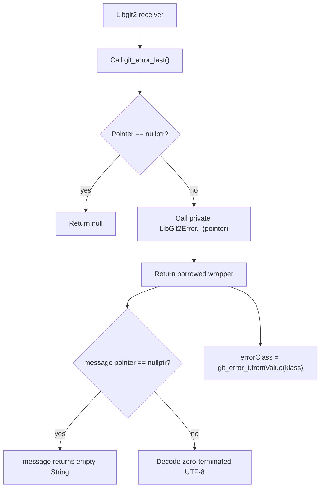

# `getLastError` Function

🟢 CONFIRMED: public callers cannot construct the wrapper from arbitrary native addresses. 🟡 INFERRED: the wrapper remains valid only while libgit2's borrowed last-error storage remains valid. 🔴 GAP: the local source-contract test does not exercise this native lifetime.
