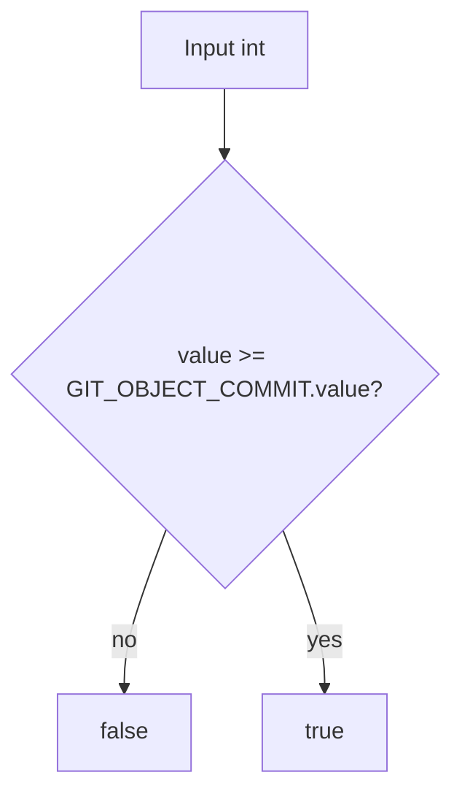

# `isValidGitObjectType` Function

🟢 CONFIRMED: this is a lower-bound predicate, not explicit membership validation. Therefore integers above the highest declared object type also satisfy the local function.
