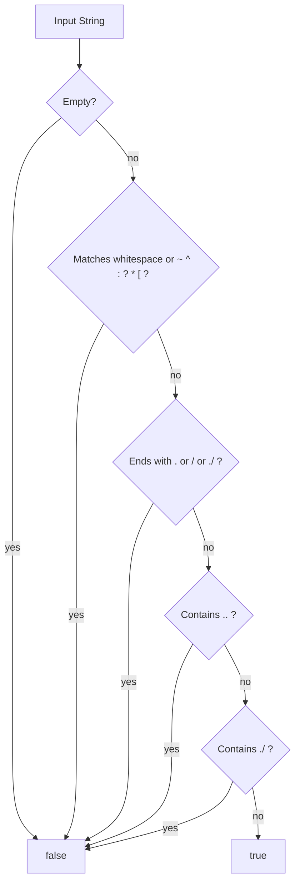

# `isValidRefName` Function

🟢 CONFIRMED: this diagram reproduces the handwritten predicate in source order. 🔴 GAP: no call to libgit2's native reference-name validator or hosted consumer execution proves that this subset is complete Git reference-name validation.
