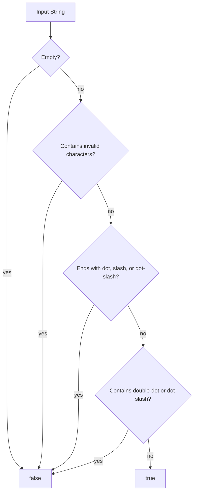

# `isValidRefName` Function

```mermaid
flowchart TD
  Start["Input String"] --> Empty{"Empty?"}
  Empty -- yes --> False["false"]
  Empty -- no --> Invalid{"Contains invalid characters?"}
  Invalid -- yes --> False
  Invalid -- no --> Suffix{"Ends with dot, slash, or dot-slash?"}
  Suffix -- yes --> False
  Suffix -- no --> Sequence{"Contains double-dot or dot-slash?"}
  Sequence -- yes --> False
  Sequence -- no --> True["true"]
```

