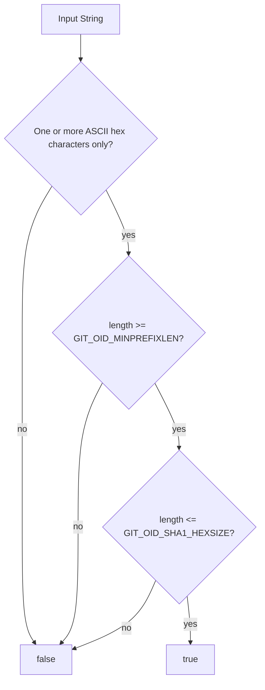

# `isValidSHA1` Function

🟢 CONFIRMED: the function combines a Dart regular expression with generated libgit2 length constants. 🔴 GAP: `bindings.dart` is absent from the working tree, so the current generated constant values were not independently inventoried in this pass.
