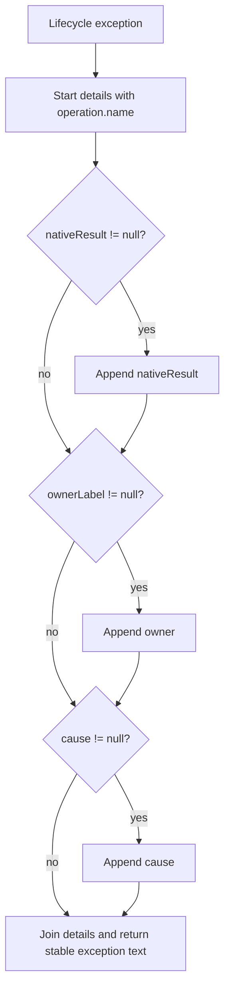

# `Libgit2LifecycleException.toString` Function

```mermaid
flowchart TD
  Start["Lifecycle exception"] --> Details["Start details with operation.name"]
  Details --> Result{"nativeResult != null?"}
  Result -- yes --> AddResult["Append nativeResult"]
  Result -- no --> Owner
  AddResult --> Owner{"ownerLabel != null?"}
  Owner -- yes --> AddOwner["Append owner"]
  Owner -- no --> Cause
  AddOwner --> Cause{"cause != null?"}
  Cause -- yes --> AddCause["Append cause"]
  Cause -- no --> Format
  AddCause --> Format["Join details and return stable exception text"]
```

🟢 CONFIRMED: `causeStackTrace` is retained as structured data but intentionally not included by `toString()`.
