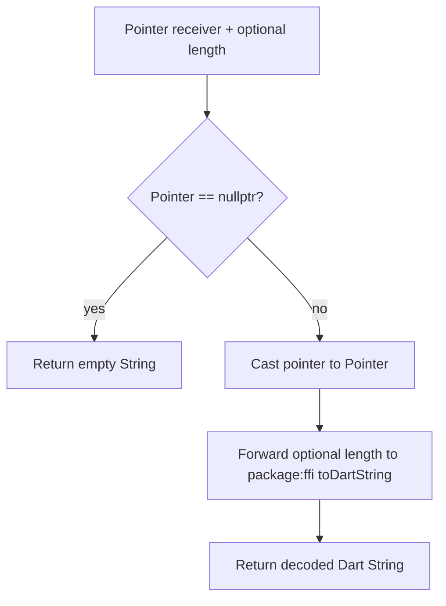

# `toDartString` Function

🟢 CONFIRMED: the helper does not allocate, free, or take ownership of the native pointer. 🟡 INFERRED: pointer validity and buffer length are caller obligations because the helper performs no bounds or lifetime validation.
