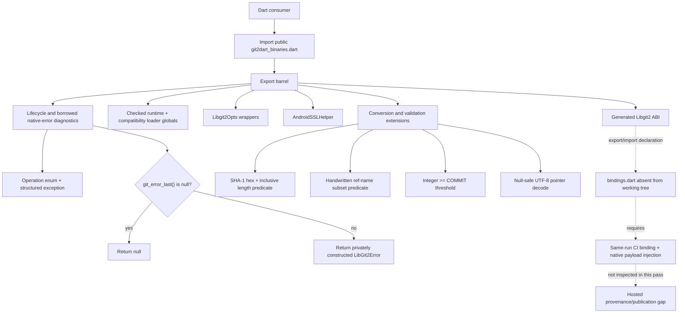

# Dart FFI Facade Flow

🟢 CONFIRMED: the public entry, helper branches, and private native-error construction follow the local source shown above. 🟡 INFERRED: a higher-level Dart package uses the facade in production because no external consumer call sites were inspected. 🔴 GAP: source exports and local tests do not prove a same-run hosted package assembly, runtime execution, or publication.
