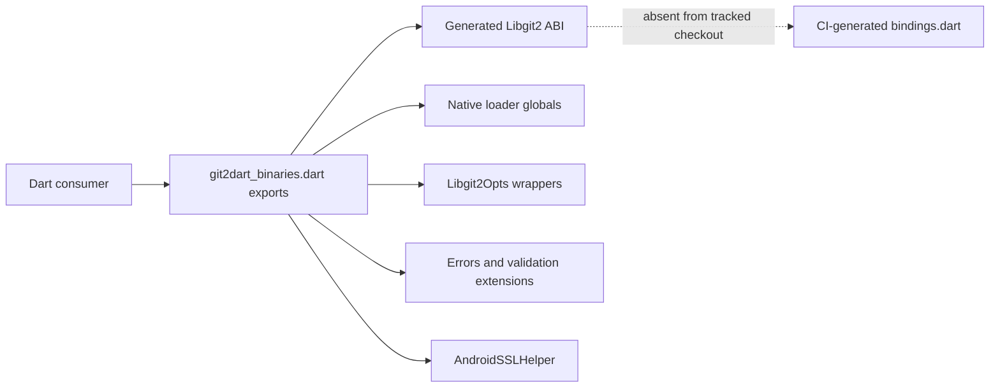

# Dart FFI Facade Flow

```mermaid
flowchart LR
  Consumer["Dart consumer"] --> Barrel["git2dart_binaries.dart exports"]
  Barrel --> Generated["Generated Libgit2 ABI"]
  Barrel --> Loader["Native loader globals"]
  Barrel --> Options["Libgit2Opts wrappers"]
  Barrel --> Helpers["Errors and validation extensions"]
  Barrel --> AndroidTLS["AndroidSSLHelper"]
  Generated -. "absent from tracked checkout" .-> Gap["CI-generated bindings.dart"]
```

🟢 CONFIRMED: the public entry is an export barrel. 🟡 INFERRED: the neighboring `git2dart` package is the principal consumer.

