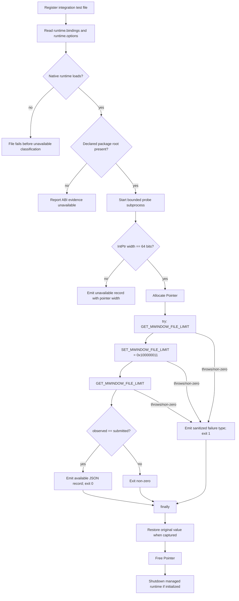

# Feature-005 Pointer-Width ABI Probe

🟢 CONFIRMED: with a loadable 64-bit payload this is a real libgit2 set/get round trip above `uint32`, not a source-string assertion. 🔴 GAP: missing package-root classification occurs only after file-level runtime access succeeds, and this extraction did not inspect a same-run hosted execution.
