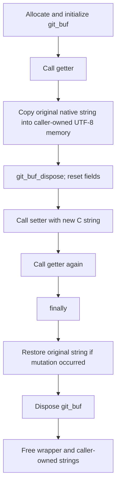

# Buffer Option Round-Trip Pattern

🟢 CONFIRMED: search-path and user-agent tests execute this native mutation/restoration pattern when the payload loads. 🟡 Evidence is status-based because the second buffer contents are not asserted against the requested value.

