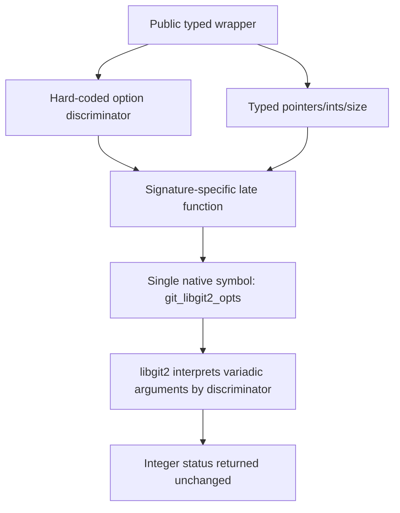

# `git_libgit2_opts_*` Dispatch Pattern

```mermaid
flowchart TD
  Method["Public typed wrapper"] --> Op["Hard-coded option discriminator"]
  Method --> Args["Typed pointers/ints/size"]
  Op --> Call["Signature-specific late function"]
  Args --> Call
  Call --> Symbol["Single native symbol: git_libgit2_opts"]
  Symbol --> Native["libgit2 interprets variadic arguments by discriminator"]
  Native --> Result["Integer status returned unchanged"]
```

