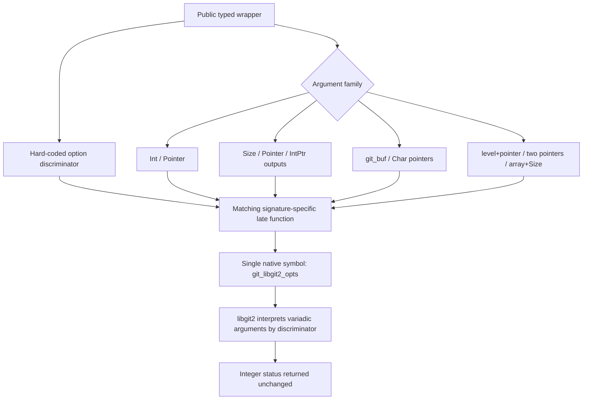

# `git_libgit2_opts_*` Dispatch Pattern

🟢 CONFIRMED: all 14 adapters use `ffi.Int` for the leading discriminator and exact tuple types for the remaining variadic arguments. 🔴 GAP: generated discriminator numbers and pinned-header equivalence are external to the current working tree.
