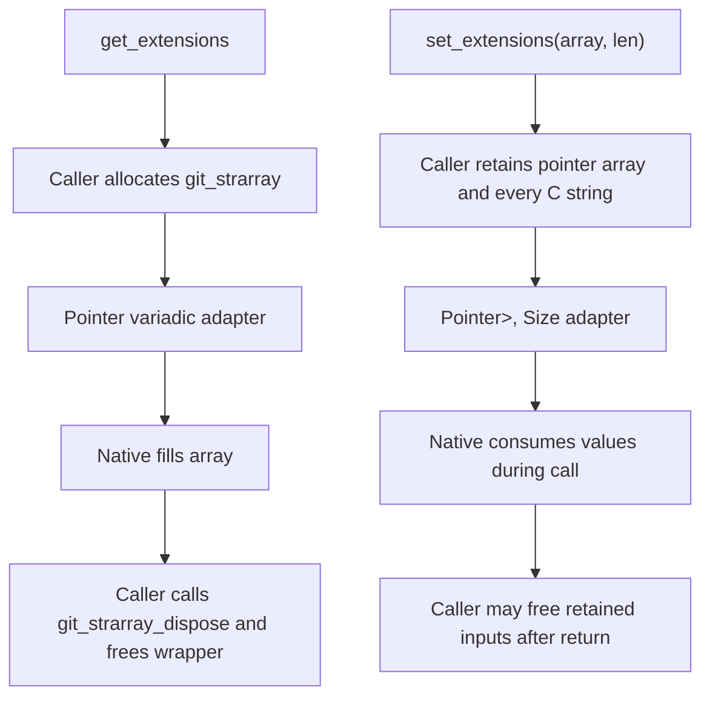

# Repository Extensions Option Flow

🟢 CONFIRMED: source declares both exact ownership shapes. 🟢 The getter has a native success/disposal test when payload prerequisites load. 🔴 The setter and pointer-width array length have no direct current behavior test.
