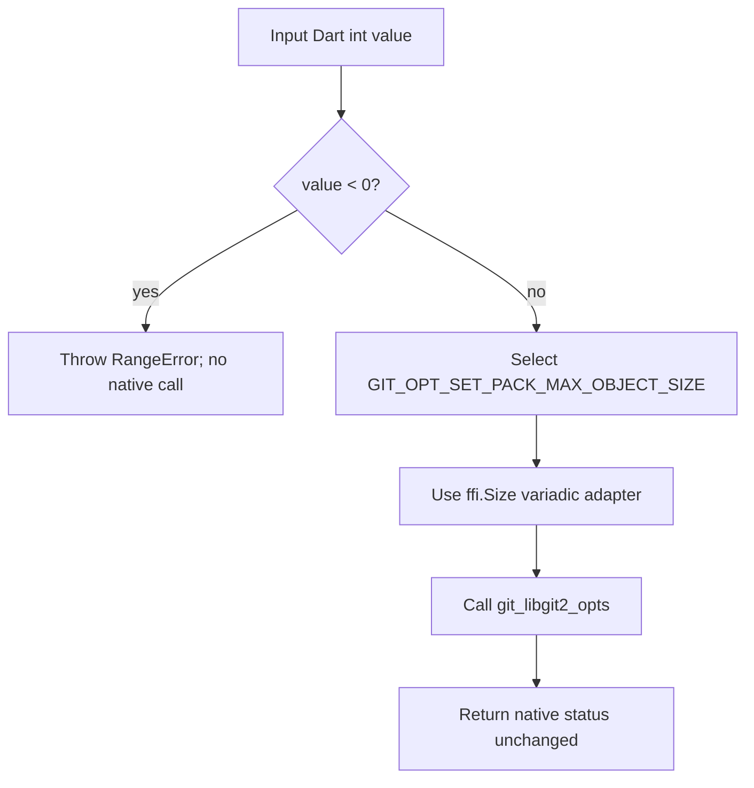

# `git_libgit2_opts_set_pack_max_object_size` Function

🟢 CONFIRMED: this is the only explicit Dart-side range check in the 33-wrapper surface. Other size/int wrappers delegate validation to FFI/native behavior.

