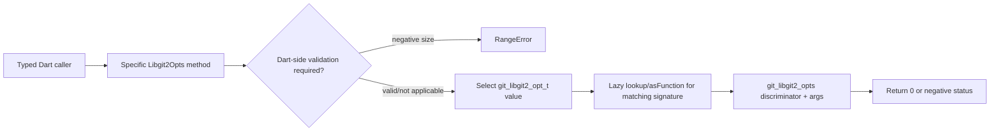

# libgit2 Global Options Flow

```mermaid
flowchart LR
  Caller["Typed Dart caller"] --> Wrapper["Specific Libgit2Opts method"]
  Wrapper --> Validate{"Dart-side validation required?"}
  Validate -->|negative size| Range["RangeError"]
  Validate -->|valid/not applicable| Discriminator["Select git_libgit2_opt_t value"]
  Discriminator --> Lazy["Lazy lookup/asFunction for matching signature"]
  Lazy --> Variadic["git_libgit2_opts discriminator + args"]
  Variadic --> Status["Return 0 or negative status"]
```

